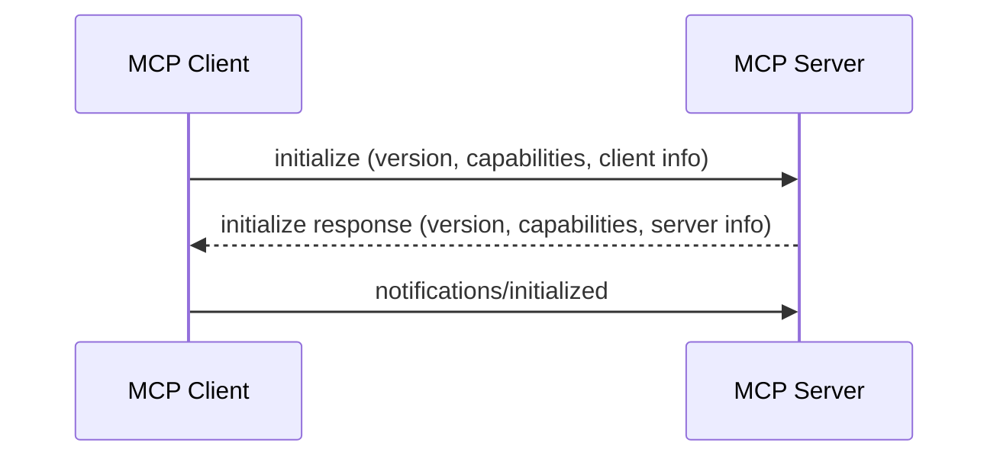

# 3. 协议详解

## JSON-RPC 2.0 基础

MCP 使用 JSON-RPC 2.0 作为通信协议

<v-clicks>

* **请求**: `{"jsonrpc": "2.0", "method": "tools/list", "id": 1}`
* **响应**: `{"jsonrpc": "2.0", "result": {...}, "id": 1}`
* **错误**: `{"jsonrpc": "2.0", "error": {...}, "id": 1}`

</v-clicks>

---

# 初始化握手



---

# 核心方法

## 1. 工具相关

| 方法 | 描述 |
|------|------|
| `tools/list` | 获取可用工具列表 |
| `tools/call` | 调用指定工具 |

## 2. 资源相关

| 方法 | 描述 |
|------|------|
| `resources/list` | 获取可用资源列表 |
| `resources/read` | 读取资源内容 |

## 3. 提示词相关

| 方法 | 描述 |
|------|------|
| `prompts/list` | 获取可用提示词列表 |
| `prompts/get` | 获取指定提示词 |

---

# 工具调用示例

<div class="grid grid-cols-2 gap-4 text-sm">

<div>

**请求**

```json
{
  "jsonrpc": "2.0",
  "id": 1,
  "method": "tools/call",
  "params": {
    "name": "get_weather",
    "arguments": { "city": "Beijing" }
  }
}
```

</div>

<div>

**响应**

```json
{
  "jsonrpc": "2.0",
  "id": 1,
  "result": {
    "content": [{
      "type": "text",
      "text": "北京今天天气晴朗，气温25°C"
    }]
  }
}
```

</div>

</div>

---

# 安全模型

<div class="grid grid-cols-3 gap-3 text-sm">

<div class="bg-orange-50 dark:bg-orange-900/30 p-3 rounded-lg border border-orange-200 dark:border-orange-800">

**1. Roots** - 权限隔离

* 限制文件访问范围
* 上下文感知

</div>

<div class="bg-cyan-50 dark:bg-cyan-900/30 p-3 rounded-lg border border-cyan-200 dark:border-cyan-800">

**2. Sampling** - 反向调用

* Server 请求 Host 调用 LLM
* 实现复杂推理

</div>

<div class="bg-pink-50 dark:bg-pink-900/30 p-3 rounded-lg border border-pink-200 dark:border-pink-800">

**3. OAuth** - 认证流程

* 标准化认证
* 安全访问资源

</div>

</div>

---
layout: center
---
# 本章小结：协议

<v-clicks>

1. **JSON-RPC 2.0** 基础通信协议
2. **核心方法**: tools/resources/prompts
3. **安全模型**: Roots、Sampling、OAuth

</v-clicks>
