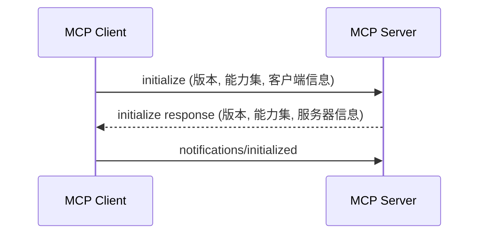
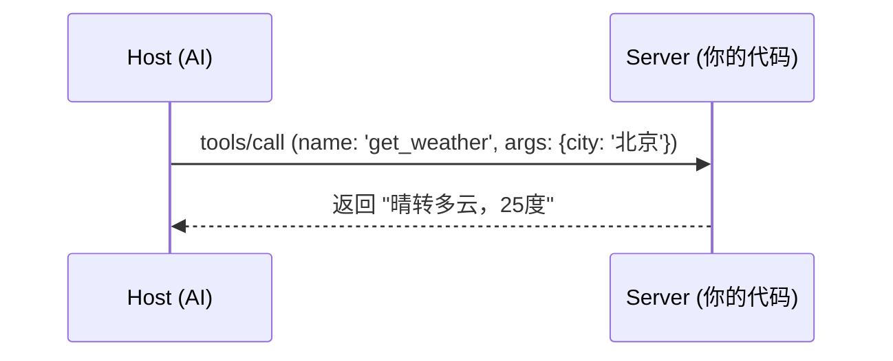

# Model Context Protocol (MCP) 深度解析

AI 协作的“万能适配器”标准

  
    开始探索 <carbon:arrow-right class="inline"/>
  

---

# 1. 为什么需要 MCP？

### 现状：碎片化的集成
- 每个 AI 客户端（Claude, Cursor, VS Code）都需要为每个数据源（GitHub, Slack, DB）重复编写代码。
- **N 个客户端 × M 个数据源 = N*M 次重复劳动**。

### 方案：统一标准
- **MCP** 就像是电子世界的 **Type-C 标准**。
- **一次编写，到处运行**：只需构建一个 MCP Server，即可适配所有支持 MCP 的客户端。

---

# 2. 核心架构：三大参与者

 

- **MCP Host (宿主)**
  - AI 应用程序（如 Claude Desktop, Cursor）。
  - 它是控制中心，决定何时调用工具。

- **MCP Client (客户端)**
  - 集成在 Host 内部。
  - 负责维护与特定 Server 的连接。

- **MCP Server (服务器)**
  - 能力提供方。
  - 通过资源、工具和提示词向外暴露功能。

---

# 3. 交互原理：JSON-RPC 2.0

### 初始化握手 (Handshake)

### 工具调用 (Tool Execution)

---

# 4. 渐进式实战路径

1. **引入与接入**
   - 在 Claude Desktop 中配置本地 Server。
   - 观察 AI 如何自动识别工具。

2. **调试与定位**
   - 使用 **MCP Inspector** 独立测试。
   - 掌握 `console.error` 调试技巧。

3. **自定义开发**
   - 编写自己的工具逻辑（如文件读取、API 调用）。

4. **发布与分发**
   - 适配多 Host（Cursor, Zed）。
   - 发布到 Smithery.ai 注册表。

---

# 5. 进阶探索

- **Resources (资源)**：只读数据流。
- **Sampling (采样)**：Server 反向请求 Host 调用 LLM。
- **Roots (根目录)**：权限隔离与上下文感知。

---
layout: center
class: text-center
---

# 谢谢观看！

[查看详细文档](https://blog.zenheart.site/learn-ai/)
