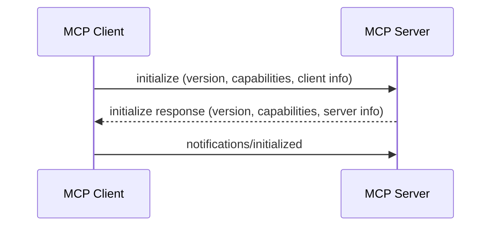
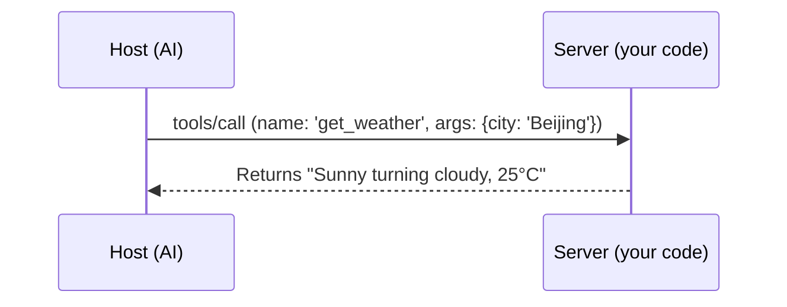

# Model Context Protocol (MCP) Deep Dive

The "Universal Adapter" Standard for AI Collaboration

  
    Start Exploring <carbon:arrow-right class="inline"/>
  

---

# 1. Why Do We Need MCP?

### Current State: Fragmented Integration
- Every AI client (Claude, Cursor, VS Code) needs to repeatedly write code for every data source (GitHub, Slack, DB).
- **N clients × M data sources = N*M redundant work**.

### Solution: Unified Standard
- **MCP** is like the **Type-C standard** for the digital world.
- **Write once, run everywhere**: Build one MCP Server, and it works with all MCP-compatible clients.

---

# 2. Core Architecture: Three Key Participants

 

- **MCP Host**
  - AI applications (like Claude Desktop, Cursor).
  - The control center that decides when to call tools.

- **MCP Client**
  - Integrated within the Host.
  - Maintains connections with specific Servers.

- **MCP Server**
  - Capability provider.
  - Exposes functionality through resources, tools, and prompts.

---

# 3. Interaction Principles: JSON-RPC 2.0

### Initialization Handshake

### Tool Execution

---

# 4. Progressive Practice Path

1. **Introduction & Integration**
   - Configure local Server in Claude Desktop.
   - Observe how AI automatically identifies tools.

2. **Debugging & Troubleshooting**
   - Use **MCP Inspector** for independent testing.
   - Master `console.error` debugging techniques.

3. **Custom Development**
   - Write your own tool logic (e.g., file reading, API calls).

4. **Publishing & Distribution**
   - Support multiple Hosts (Cursor, Zed).
   - Publish to Smithery.ai registry.

---

# 5. Advanced Exploration

- **Resources**: Read-only data streams.
- **Sampling**: Server reverse-requests Host to call LLM.
- **Roots**: Permission isolation and context awareness.

---
layout: center
class: text-center
---

# Thank You!

[View Full Documentation](https://blog.zenheart.site/learn-ai/)
