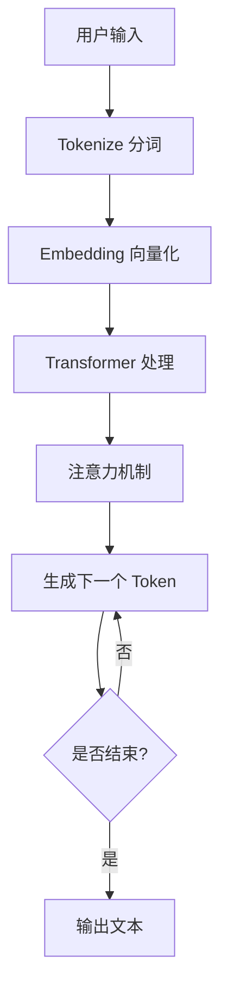

# 课程目标

<h3>
掌握 Prompt Engineering ，理解 Context Engineering ，实现高效 AI 交互！
</h3>

   

   1. **原理** 理解 LLM 核心概念（Token、Transformer、Attention）

   

   

   2. **Prompt** 掌握 Prompt 工程核心框架与技巧

   

   

   3. **Context** 理解上下文工程（RAG、记忆机制）

   

   

   4. **实战** 深入典型场景，学会高效 AI 交互

   

   <strong>🎯 目标级别：L3 - 能够优化提示词提升输出质量</strong>

---

# 课程大纲

1. **概述** LLM 核心概念（Token、Context Window、Transformer）
2. **Prompt 工程** 核心框架（ICIO）、Zero-shot、Few-shot、CoT
3. **Context 工程** 上下文管理、RAG、记忆机制
4. **工具调用** Function Calling、Tool Use 最佳实践
5. **实战** 代码生成、知识问答、数据处理
6. **总结与 QA**

layout: two-cols
---
# 1. LLM 核心概念

## Token（令牌）

- **定义**: 模型处理信息的最小文本单位
- **计算**:
  - 英文：约 4 字符 ≈ 1 token
  - 中文：通常 1 字 ≈ 1 token
  - 具体取决于分词器模型
- **重要性**: 计费和上下文限制的基础单位

::right::

## Context Window（上下文窗口）

- **定义**: 模型能处理的最大 Token 数量
- **组成**: 输入 Token + 输出 Token
- **现状**: 现代 LLM 通常支持 100K-200K tokens
  - Claude 3.5/3.7 Sonnet: 200K tokens
  - GPT-4o: 128K tokens
  - Gemini 2.0: 2M tokens

layout: two-cols
---
# Transformer 原理

## 自注意力机制（Self-Attention）

> 模型能够"理解"文本中词语之间关系的关键技术

<v-clicks>

1. **并行处理**: 同时处理所有词语
2. **关注关系**: 计算词语间的相关性权重
3. **长距离依赖**: 捕捉远距离词语的关联

</v-clicks>

::right::

## 为什么重要？

<v-clicks>

- **理解上下文**: "它"指代什么？
- **生成连贯**: 前后文一致性
- **知识整合**: 跨段落信息关联

</v-clicks>

---

# LLM 工作流程

<v-click>

**核心**: 模型通过预测下一个最可能的 token 来生成文本

</v-click>

---
layout: center
---
# 本章小结：LLM 基础

<v-clicks>

1. **Token** 是模型处理的最小单位，影响成本和上下文限制
2. **Context Window** 是模型能处理的最大 Token 数
3. **Transformer** 的自注意力机制使模型理解上下文
4. **LLM 本质** 是根据输入预测下一个最可能的 token

</v-clicks>
