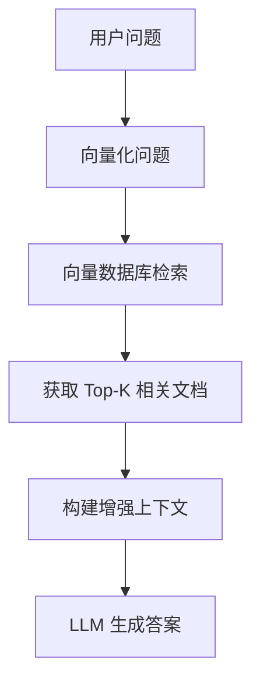

# 3. Context Engineering

## 什么是 Context Engineering？

> **上下文工程** 是管理和优化与大模型交互时的上下文信息的实践，确保模型能够准确理解任务背景并生成相关响应。

<v-clicks>

* **解决核心问题**: 模型"忘记"之前对话内容
* **扩展能力**: 让模型访问实时/私有信息
* **降低成本**: 精确管理上下文，避免浪费 Token

</v-clicks>

---

# 上下文管理策略

## 1. 对话历史管理

```python
# LangChain 示例：手动管理对话历史
messages = [
    {"role": "user", "content": "我叫 Bob"}
]

response = model.invoke(messages)

# 追加历史
messages.extend([
    response,
    {"role": "user", "content": "我叫什么名字？"}
])

response2 = model.invoke(messages)
```

<v-click>

**核心**: 维护消息列表，持续传递给模型

</v-click>

---

# 上下文管理策略

## 2. 消息修剪（Message Trimming）

```python
# LangChain: 保留开头和最后几条消息
@before_model
def trim_messages(state, runtime):
    messages = state["messages"]
    if len(messages) <= 3:
        return None

    first_msg = messages[0]
    recent_messages = messages[-4:]
    new_messages = [first_msg] + recent_messages

    return {"messages": [RemoveMessage(id=REMOVE_ALL_MESSAGES), *new_messages]}
```

<v-click>

**目的**: 防止超出 Context Window 限制

</v-click>

---

# RAG（检索增强生成）

## 核心概念

> RAG = Retrieval（检索）+ Augmented（增强）+ Generation（生成）

<v-clicks>

1. **检索**: 从外部知识库获取相关信息
2. **增强**: 将检索结果加入上下文
3. **生成**: 基于增强后的上下文生成答案

</v-clicks>

---

# RAG 工作流程

<RAGWorkflow :step="2" />

<!--
RAGWorkflow 组件展示：
1. 用户提问 - 输入自然语言问题
2. 向量化 - 将问题转换为向量表示
3. 向量检索 - 在向量数据库中搜索相似内容
4. 构建上下文 - 将检索结果注入上下文
5. LLM 生成 - 基于增强上下文生成答案
-->



<v-clicks>

* **解决**: 模型知识过时、幻觉问题
* **优势**: 可访问私有/实时数据
* **场景**: 企业知识库、文档问答

</v-clicks>

---

# 记忆机制

## 1. 短期记忆（Short-term Memory）

<v-clicks>

* **对话历史**: 当前会话的完整消息
* **实现**: 消息列表，会话结束时清除

</v-clicks>

## 2. 长期记忆（Long-term Memory）

<v-clicks>

* **持久化存储**: 跨会话保持状态
* **实现**: 数据库、向量存储
* **场景**: 用户偏好、历史交互

</v-clicks>

---

# 记忆实现示例

```python
# LangChain: Checkpoint 持久化
from langgraph.checkpoint.memory import InMemorySaver

checkpointer = InMemorySaver()

# 持久化保存
config = {"configurable": {"thread_id": "1"}}
agent.invoke({"messages": "hi, my name is bob"}, config)

# 恢复对话（thread_id 相同）
agent.invoke({"messages": "what's my name?"}, config)
# 模型记得 "Bob"
```

---

# 记忆优化策略

## 1. 摘要记忆（Summarization）

```python
# LangGraph: 自动摘要
summarization_node = SummarizationNode(
    token_counter=count_tokens,
    max_tokens=256,
    max_tokens_before_summary=256,
)
```

<v-clicks>

* **触发**: 消息过长时自动摘要
* **优势**: 压缩信息，保留核心

</v-clicks>

## 2. 选择性记忆

<v-clicks>

* 只保留关键信息
* 定期清理无用历史

</v-clicks>

---

# Context Engineering 最佳实践

<v-clicks>

1. **了解 Context Window**
   - 清楚模型的 Token 上限
   - 合理分配输入/输出空间

2. **优先重要信息**
   - 核心指令放前面
   - 示例靠近任务描述

3. **及时修剪**
   - 定期清理无用历史
   - 使用摘要压缩

4. **RAG + 记忆**
   - RAG: 外部知识
   - 记忆: 对话历史

</v-clicks>

---
layout: center
---
# 本章小结：Context 工程

<v-clicks>

1. **上下文管理**: 对话历史、消息修剪
2. **RAG**: 检索增强生成，解决知识过时问题
3. **记忆机制**: 短期/长期/摘要，跨会话保持状态
4. **最佳实践**: 优先重要信息，及时修剪

</v-clicks>
