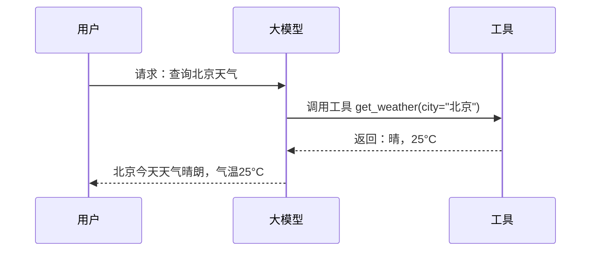

# 4. Tool Calling

## 什么是 Tool Calling？

> **工具调用** 允许 LLM 执行外部操作（API 调用、数据库查询、文件处理等），扩展模型能力边界。

<v-clicks>

* **扩展能力**: 模型可以执行实际操作
* **实时信息**: 获取最新/私有数据
* **自动化**: 端到端完成任务

</v-clicks>

---

# Tool Calling 工作原理



---

# 工具定义示例

```python
tools = [
    {
        "name": "get_weather",
        "description": "获取指定城市的天气信息",
        "input_schema": {
            "type": "object",
            "properties": {
                "city": {
                    "type": "string",
                    "description": "城市名称，如北京、上海"
                }
            },
            "required": ["city"]
        }
    }
]
```

<v-click>

**关键**: 清晰的 description 帮助模型理解何时调用

</v-click>

---

# Claude Code 中的工具调用

## MCP 工具

```
mcp__context7__query-docs
mcp__github__list_issues
mcp__chrome-devtools__navigate_page
```

<v-clicks>

* **前缀**: `mcp__` 表示 MCP 协议工具
* **自动发现**: Claude Code 自动加载可用工具
* **按需调用**: 模型根据任务自动选择

</v-clicks>

---

# 最佳实践

## 1. 工具描述清晰

```
# ❌ 差
"查询天气"

# ✅ 好
"获取指定城市的当前天气状况，包括温度和天气状况"
```

<v-clicks>

2. **参数定义完整**
   - 指定类型
   - 提供描述
   - 标记必需参数

3. **错误处理**
   - 处理工具调用失败
   - 提供降级方案

</v-clicks>

---

# Tool Calling vs MCP

| 特性 | Tool Calling | MCP |
|------|--------------|-----|
| **定义位置** | 代码中定义 | 独立 Server |
| **通信方式** | SDK 内置 | 标准化协议 |
| **适用范围** | 简单工具 | 复杂系统 |
| **生态** | 模型内置 | 标准化生态 |

<v-click>

**MCP**: 更通用的工具扩展标准

</v-click>

---
layout: center
---
# 本章小结：Tool Calling

<v-clicks>

1. **核心**: 扩展 LLM 执行实际操作的能力
2. **原理**: 模型识别意图 → 调用工具 → 处理结果 → 生成响应
3. **最佳实践**: 清晰描述、完整参数、错误处理
4. **MCP**: 标准化的工具扩展协议

</v-clicks>
