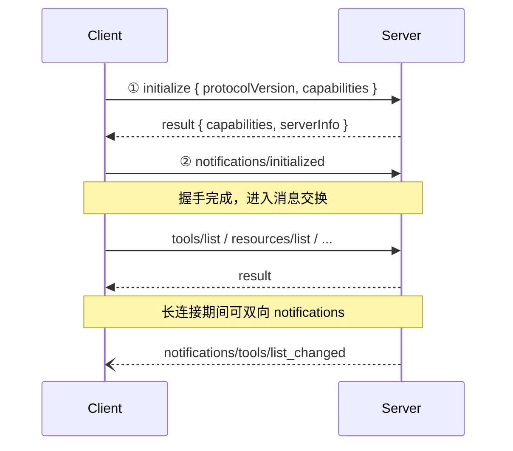

# 02.1 · MCP 核心

让 AI 能伸手 —— Model Context Protocol

---
layout: two-cols-header
---

# 1. 为什么需要 MCP？(溯源痛点)

> 在 MCP 出现之前，AI 访问外部数据面临着灾难性的 **N × M 集成噩梦**。

::left::

<div class="col-bad mt-4">

### ❌ 过去的痛点 (N × M)

假设有 **N** 个 AI 工具（Cursor / Claude / Windsurf / v0 ...），<br>
企业有 **M** 个数据源（DB / Jira / GitLab / Confluence ...）。

* 每个 AI 工具都要**独立适配**每个数据源
* `N × M` 次集成代码，重复造轮子
* API 密钥四处散落，安全风险高

</div>

::right::

<div class="col-good mt-4">

### ✅ Anthropic 的解法 (N + M)

2024 年底 Anthropic 提出 [Model Context Protocol](https://www.anthropic.com/news/model-context-protocol)：

* 制定**通用的双向通信标准**
* 架构变为 `N + M`
* **一次开发 MCP Server**，所有 MCP 客户端即插即用
* 密钥封装在 Server 端，对模型隔离

</div>

---
layout: center
---

# MCP 是什么？

<div class="punchline mt-2">
MCP 不是一个工具 ——
<br>
<span class="accent">它是工具的标准。</span>
</div>

<div class="mt-8 text-base text-slate-600 max-w-3xl mx-auto">

官方原文（[modelcontextprotocol.io](https://modelcontextprotocol.io/docs/concepts/architecture)）：

> "MCP focuses solely on the **protocol** for context exchange —
> it does **not dictate** how AI applications use LLMs or manage the provided context."

</div>

<div class="mt-6 text-sm text-slate-500">
就像 USB-C —— 一根线统一所有设备，但充电方式 / 数据协议由设备决定。
</div>

<!-- 演讲者备注：
USB-C 比喻只用一次，后面不要重复。重点强调"协议 vs 工具"的本质差别：协议层是大家共同遵守的握手方式，具体能力由 Server 自由实现。
-->

---

# 2. 三方架构 · Host / Client / Server

```
┌─────────────────────────────────────────────────────┐
│                  MCP Host                           │
│   (AI 应用：Claude Code / Cursor / VS Code ...)     │
│                                                     │
│   ┌──────────────┬──────────────┬──────────────┐  │
│   │ MCP Client 1 │ MCP Client 2 │ MCP Client 3 │  │
│   │   (一对一)    │   (一对一)    │   (一对一)    │  │
│   └──────┬───────┴──────┬───────┴──────┬───────┘  │
└──────────┼──────────────┼──────────────┼──────────┘
           │              │              │
           ▼              ▼              ▼
   ┌──────────────┐ ┌──────────────┐ ┌──────────────┐
   │ Filesystem   │ │ Postgres     │ │ Sentry MCP   │
   │ MCP Server   │ │ MCP Server   │ │ Server       │
   │   (本地)      │ │   (本地)      │ │   (远程)      │
   └──────────────┘ └──────────────┘ └──────────────┘
```

<div class="mt-2 text-sm text-slate-600">

* **Host**：协调和管理 MCP Clients 的 AI 应用
* **Client**：与单个 Server 维持专属连接，向 Host 提供上下文（Host 一对多，Client 一对一）
* **Server**：向 Client 暴露 context；可本地（stdio）也可远程（Streamable HTTP）

</div>

<!-- 演讲者备注：
官方文档原话：VS Code 同时连 Sentry MCP Server + filesystem server 的真实例子。
关键点：Host 可以同时连多个 Server，每个 Server 对应一个 Client 实例。
-->

---

# 3. 两层结构 · Data Layer + Transport Layer

<div class="grid grid-cols-2 gap-6 mt-6">

<div class="theme-mcp">

### 🔼 Data Layer（内层）

基于 **JSON-RPC 2.0** 的消息协议：

* **Lifecycle**：连接初始化 / capability 协商 / 终止
* **Server 原语**：Tools / Resources / Prompts
* **Client 原语**：Sampling / Elicitation / Logging
* **Notifications**：实时变更（如 `tools/list_changed`）

</div>

<div class="theme-skill">

### 🔽 Transport Layer（外层）

通信通道与鉴权：

* **stdio**：本地子进程，行分隔 JSON-RPC（推荐首选）
* **Streamable HTTP**：远程 Server，POST + 可选 SSE 流，OAuth/Bearer
* ~~HTTP+SSE~~：已废弃（2024-11-05 协议遗留）

</div>

</div>

<div class="mt-4 text-sm text-slate-500 text-center">
同一份 JSON-RPC 消息可在任意 Transport 上传输 —— 这就是协议的力量。
</div>

---
layout: full-vibe
class: p-0
clicks: 7
---

<MCPWorkflow />

<!-- 演讲者备注：
配合 MCPWorkflow 组件 7 步演示：① Host 发起 → ② Client 接收 → ③ JSON-RPC 通信 → ④ Server 执行 → ⑤ 返回结果 → ⑥ LLM 处理 → ⑦ 完成。
强调：Tool 调用是"AI 申请，宿主执行"的握手，不是 AI 直接拿到了系统权限。
-->

---

---
layout: full-vibe
class: 'p-8'
clicks: 3
---

# 4. 三大原语 · 谁在控制？

<div class="mt-3">
  <MCPPrimitivesMatrix />
</div>

<!-- 演讲者备注：
三步 v-clicks 自动切 Tab：Tools → Resources → Prompts。
现场演讲也可以点击 Tab 自由切换，每个 Tab 都给出该原语的 JSON-RPC 流程。
关键口诀："谁主动谁就是控制方。"
此外还有 Client 反向原语（sampling/elicitation/logging）和实验性 Tasks，本节不展开。
-->


---

# 4.1 Tools 深入 · 完整 JSON-RPC 流程 <span class="text-xs text-slate-400 font-normal">📎 详细规范</span>

<div class="grid grid-cols-2 gap-4 mt-2">

<div>

### 📋 `tools/list`（发现）

```json
// Request
{ "jsonrpc": "2.0", "id": 1,
  "method": "tools/list" }

// Response
{ "result": { "tools": [{
  "name": "get_weather",
  "title": "Weather",
  "description": "Get current weather",
  "inputSchema": {
    "type": "object",
    "properties": {
      "location": { "type": "string" }
    },
    "required": ["location"]
  },
  "outputSchema": { /* 可选 */ }
}]}}
```

</div>

<div>

### ⚡ `tools/call`（调用）

```json
// Request
{ "jsonrpc": "2.0", "id": 2,
  "method": "tools/call",
  "params": {
    "name": "get_weather",
    "arguments": { "location": "SF" }
  }
}

// Response
{ "result": {
  "content": [{
    "type": "text",
    "text": "SF: 68°F, partly cloudy"
  }],
  "isError": false
}}
```

</div>

</div>

<div class="mt-3 text-xs text-slate-500">
错误两类：① 协议错误 → JSON-RPC <code>error</code>（如 <code>-32602</code>）；② 工具执行错误 → <code>result.isError = true</code>。
</div>

<!-- 演讲者备注：
30 秒过完。重点强调最后那行错误两类 —— 这是 04.practice 写错误处理时会反复用到的。
时间紧时可以一笔带过 outputSchema，告诉听众"严格场景下还可以声明返回 schema"。
-->


---

# 4.2 Resources 深入 · URI 是身份证 <span class="text-xs text-slate-400 font-normal">📎 详细规范</span>

<div class="grid grid-cols-2 gap-4 mt-4">

<div>

### URI Schemes

```
file:///project/src/main.rs
git://repo/path
https://docs.example.com/api
postgres://db/schema/users
custom://...    （遵循 RFC 3986）
```

支持的能力：

* **`resources/list`** —— 列举
* **`resources/read`** —— 按 URI 读
* **`resources/templates/list`** —— 参数化模板（RFC 6570）
* **`resources/subscribe`** —— 订阅变更

</div>

<div>

### 注解（Annotations）

```json
{
  "uri": "file:///project/README.md",
  "name": "README.md",
  "mimeType": "text/markdown",
  "annotations": {
    "audience": ["user", "assistant"],
    "priority": 0.8,
    "lastModified": "2026-04-12T15:00:58Z"
  }
}
```

* `audience`：给谁看（user / assistant）
* `priority`：0.0–1.0，越高越重要
* `lastModified`：ISO 8601 时间戳

</div>

</div>

<!-- 演讲者备注：
现场重点对比 Tools vs Resources 的差异：Tools 是 AI 主动调；Resources 是 Host 决定塞什么进 Context（典型场景：当前打开的文件、相关的 DB schema）。
URI 那部分可以快速过。注解（audience/priority）是 advanced，时间紧可跳过。
-->


---

# 4.3 Prompts 深入 · 模板化对话 <span class="text-xs text-slate-400 font-normal">📎 详细规范</span>

```json
// prompts/list
{ "result": { "prompts": [{
  "name": "code_review",
  "title": "Request Code Review",
  "description": "Asks the LLM to analyze code quality",
  "arguments": [
    { "name": "code", "description": "The code", "required": true }
  ]
}]}}

// prompts/get
{ "method": "prompts/get",
  "params": {
    "name": "code_review",
    "arguments": { "code": "def hello():\n    print('world')" }
  }
}
// → 返回结构化 messages 数组（user + assistant）
```

<div class="mt-3 p-3 theme-combo text-sm">
💡 <strong>关键差异</strong>：Prompts 是<strong>用户主动选择</strong>（通常以 slash command 暴露给用户），不是 AI 自主调用。
</div>

<!-- 演讲者备注：
强调："Prompts 不是 system prompt，而是 MCP Server 提供给用户'快捷方式'的对话起手式。"
现场可举例：jira_ticket_brief 让用户敲 /jira_ticket_brief PROJ-1024 直接得到一个标准化汇报，比每次手敲 Prompt 高效 10 倍。
-->


---

# 5. Lifecycle · 握手三步 <span class="text-xs text-slate-400 font-normal">📎 协议细节</span>



<div class="mt-2 text-sm">

* **协议版本协商**：`protocolVersion: "2025-06-18"`，不兼容则终止
* **Capability 协商**：双方各自声明能力，避免无效请求
* **Identity 交换**：`clientInfo` / `serverInfo` 用于调试和兼容

</div>

<!-- 演讲者备注：
30 秒过。重点说："SDK 帮你把 Lifecycle 全部封装好了，但你需要知道这事 —— 调试时如果 Server 没启动好，第一处出错就在 initialize 阶段。"
时间紧可直接跳过这屏，进 Transport。
-->


---
layout: two-cols-header
---

# 6. Transport · stdio vs Streamable HTTP

::left::

<div class="theme-mcp mt-4">

### 🖥️ stdio（推荐首选）

```json
// Claude Desktop / Claude Code 配置
{
  "mcpServers": {
    "filesystem": {
      "command": "npx",
      "args": ["-y", "@modelcontextprotocol/server-filesystem", "/path"]
    }
  }
}
```

* 子进程通信，行分隔 JSON-RPC
* `stdout` 必须只发协议消息；`stderr` 可日志
* 零网络开销，本地最快

</div>

::right::

<div class="theme-skill mt-4">

### 🌐 Streamable HTTP（远程 / 集中部署）

```json
{
  "mcpServers": {
    "company-jira": {
      "type": "streamable-http",
      "url": "https://mcp.company.com/mcp",
      "headers": {
        "Authorization": "Bearer ${JIRA_TOKEN}"
      }
    }
  }
}
```

* HTTP POST + 可选 SSE 流
* OAuth / Bearer / API Key 鉴权
* 会话靠 `Mcp-Session-Id` 头维持
* **MUST** 校验 `Origin` 头防 DNS rebinding

</div>

---

# 7. 最小 MCP Server · TypeScript

```ts
// server.ts
import { McpServer } from '@modelcontextprotocol/sdk/server/mcp.js'
import { StdioServerTransport } from '@modelcontextprotocol/sdk/server/stdio.js'
import { z } from 'zod'

const server = new McpServer({ name: 'jira-mcp', version: '1.0.0' })

// 注册一个 Tool
server.tool(
  'get_jira_issue',
  '按工单 ID 从 Jira 查询工单详情，返回 status / assignee / description',
  { issueId: z.string().describe('如 PROJ-1024') },
  async ({ issueId }) => {
    const data = await fetchJiraTicket(issueId)
    return { content: [{ type: 'text', text: JSON.stringify(data, null, 2) }] }
  },
)

// 注册一个 Resource
server.resource('jira-schema', 'jira://schema', async () => ({
  contents: [{ uri: 'jira://schema', mimeType: 'application/json',
              text: JSON.stringify(JIRA_SCHEMA) }],
}))

await server.connect(new StdioServerTransport())
```

<div class="mt-2 text-xs text-slate-500">
依赖：<code>npm i @modelcontextprotocol/sdk zod</code>。<br>
启动：<code>node server.js</code> 或在 Claude Code 配置中作为 <code>command</code> 启动。
</div>

---

# 7.1 最小 MCP Server · Python (FastMCP)

```python
# server.py — 心智模型对标 FastAPI
from mcp.server.fastmcp import FastMCP

mcp = FastMCP("jira-mcp")

@mcp.tool()
def get_jira_issue(issue_id: str) -> dict:
    """按工单 ID 从 Jira 查询工单详情。"""
    return fetch_jira_ticket(issue_id)

@mcp.resource("jira://schema")
def jira_schema() -> str:
    """返回 Jira 工单字段 schema（JSON）。"""
    return json.dumps(JIRA_SCHEMA)

@mcp.prompt()
def summarize_ticket(issue_id: str) -> str:
    """生成一段适合给经理汇报的工单摘要。"""
    return f"请用 3 句话总结工单 {issue_id} 的进展、风险、下一步。"

if __name__ == "__main__":
    mcp.run()    # 默认 stdio
```

<div class="mt-2 text-xs text-slate-500">
FastMCP 自动从函数 docstring + 类型注解生成 inputSchema，对标 FastAPI 的 DX。<br>
依赖：<code>pip install mcp</code>。
</div>

---
layout: two-cols-header
---

# 8. 在工具中配置 MCP Server <span class="text-xs text-slate-400 font-normal">📎 配置参考</span>

::left::

<div class="mt-2">

### Claude Code · CLI

```bash
# 注册 stdio Server
claude mcp add jira-local \
  -- node /path/to/server.js

# 注册远程 Server
claude mcp add company-jira \
  --transport streamable-http \
  --url https://mcp.company.com/mcp \
  --header "Authorization: Bearer $TOKEN"

# 列出 / 移除
claude mcp list
claude mcp remove jira-local
```

</div>

::right::

<div class="mt-2">

### Claude Desktop · 配置文件

```json
// ~/Library/Application Support/
//   Claude/claude_desktop_config.json
{
  "mcpServers": {
    "filesystem": {
      "command": "npx",
      "args": ["-y",
        "@modelcontextprotocol/server-filesystem",
        "/Users/me/work"]
    }
  }
}
```

Cursor / VS Code / Windsurf 配置类似（JSON 格式互通）。

</div>

<div class="mt-2 text-xs text-slate-500">
🛠️ 调试神器：<a href="https://github.com/modelcontextprotocol/inspector">MCP Inspector</a> —— 可视化查看 list/call 流程，命中错误立刻看到。
</div>

<!-- 演讲者备注：
快速过。听众主要记住三点：① CLI 用 claude mcp add；② 配置文件用 JSON；③ Inspector 是调试 MCP 的 Postman。
所有配置语法听众回头自己查官方文档即可，不用现场记。
-->


---

# 9. Tool 设计 · Bad / Good

<div class="grid grid-cols-2 gap-6 mt-4">

<div class="col-bad">

### ❌ 模糊的 Tool description

```ts
server.tool('query_jira', '查 Jira', {/* ... */})
```

* AI 不知道何时该用、能传什么
* description 缺关键词，无法语义匹配
* 与其他 query-类 Tool 互相干扰

</div>

<div class="col-good">

### ✅ 精准的 Tool description

```ts
server.tool(
  'get_jira_issue',
  '按工单 ID 从 Jira 查询工单详情。' +
  '返回 status / assignee / description / labels。' +
  '当用户提到"PROJ-1234 这单"或要求"查工单状态"时调用。',
  { issueId: z.string().describe('如 PROJ-1024') },
  /* ... */
)
```

* 明确「做什么 + 何时用 + 返回什么」
* 含 PROJ- / 工单状态等高区分度关键词
* 入参用 zod 严格约束 + 单条 description

</div>

</div>

---

# 10. 安全红线（生产必读）<span class="text-xs text-slate-400 font-normal">📎 上线 checklist</span>

<div class="table-scroll mt-3">

| 角色 | 等级 | 必须做 / 应该做 |
|---|---|---|
| **Server** | **MUST** | 校验所有 Tool 输入；实施访问控制；限流；清洗输出 |
| **Server** | **MUST** | 远程 Server 校验 `Origin` 头防 DNS rebinding；本地仅绑 `127.0.0.1` |
| **Server** | **SHOULD** | OAuth 取 token，避免长期密钥；启用 audit log |
| **Client** | **SHOULD** | 敏感操作弹用户确认；调用前展示 Tool 入参；设超时 |
| **Client** | **SHOULD** | 不信任 Server 返回的 tool annotations，除非来自可信源 |

</div>

<div class="mt-4 p-3 col-bad text-sm">

⚠️ <strong>真实事故模式</strong>：Server 没校验 Origin → 攻击者通过 DNS rebinding 让恶意网页直接调你的本地 MCP Server → 数据库被脱裤。

</div>

<!-- 演讲者备注：
重点强调最后那个真实事故 —— 这是上生产前必须懂的。
表格其余项可以快速点过：MUST 是必须做，SHOULD 是强烈建议。
时间紧可以让听众扫一眼表格然后跳过。
-->


---
layout: center
---

# 11. MCP 生态盘点

<div class="mt-4 grid grid-cols-3 gap-3 text-xs">

<div class="theme-mcp">

### 🏗️ 基础设施

* HashiCorp **Terraform**
* AWS Labs **AWS MCP**
* **Cloudflare** Workers/KV/R2
* **Pulumi** IaC
* Aliyun ECS/OOS

</div>

<div class="theme-mcp">

### 🛠️ 开发工作流

* Microsoft **Playwright**
* **GitHub** MCP
* **Sentry** MCP
* **Linear** / **Notion**
* **Slack** / **GitLab**

</div>

<div class="theme-mcp">

### 🧪 代码与数据

* Pydantic AI **mcp-run-python**
* `modelcontextprotocol/servers`
  * filesystem
  * git
  * postgres
  * fetch
  * brave-search

</div>

</div>

<div class="mt-6 text-center text-sm text-slate-500">

📚 索引：<a href="https://github.com/punkpeye/awesome-mcp-servers">awesome-mcp-servers</a> ⭐ 85.9k ·
<a href="https://glama.ai/mcp/servers">glama.ai/mcp/servers</a>

</div>

---
layout: center
---

# 本章小结 · MCP 核心

<v-clicks>

1. **本质**：MCP 是协议，不是工具 —— 一次开发，所有客户端复用
2. **三方架构**：Host 一对多 Clients，Client 一对一 Server
3. **两层结构**：Data Layer (JSON-RPC 2.0) × Transport Layer (stdio / Streamable HTTP)
4. **三大原语**：Tools (model) / Resources (app) / Prompts (user) —— 谁主动谁是控制方
5. **生产红线**：Origin 校验 / 输入清洗 / 工具调用前用户可见

</v-clicks>

<div v-click="6" class="mt-6 punchline">
能力上限给到了 ——
<br>
下一章：<span class="accent-skill">怎么让 AI 稳定地用</span>。
</div>
