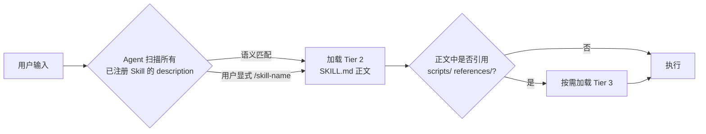

# 02.2 · Skill 核心

让 AI 会做事 —— Agent Skills 规范

---
layout: center
---

# Skill 是什么？

<div class="punchline mt-2">
Skill 是
<span class="accent-skill">被冻结的最佳实践</span>。
</div>

<div class="mt-8 max-w-3xl mx-auto text-base text-slate-600">

引官方定义（[agentskills.io](https://agentskills.io/specification)）：

> "A skill is a directory containing, at minimum, a `SKILL.md` file
> with metadata + instructions for performing a specific task."

</div>

<div class="mt-6 text-sm text-slate-500">
不是一段对话提示词，不是一个 Tool —— 是一个**目录**，里面有规范化的指令、可选的脚本和资源。
</div>

<!-- 演讲者备注：
强调三个"不是"：① 不是 system prompt；② 不是 Tool（Tool 是 MCP 提供的）；③ 不是 .cursorrules（rules 永远进 Context）。
关键差别：Skill 的载体是"目录" —— 这意味着可以装 references/ 和 scripts/，按需加载，不爆 Context。
-->


---
layout: two-cols-header
---

# 1. 为什么需要 Skill？

::left::

<div class="col-bad mt-4">

### ❌ 没有 Skill 的世界

* 团队规范靠文档没人读
* 同样的 Prompt 反复粘贴
* 每个新人都要被 onboard 一遍
* AI 输出风格因人而异

**结果**：知识在工程师脑子里，不在工程系统里。

</div>

::right::

<div class="col-good mt-4">

### ✅ 有 Skill 的世界

* SOP 沉淀为 `SKILL.md`，进 Git 管理
* 关键词命中自动激活，不用记命令
* 新人开箱即用同一套标准
* 输出风格、流程、错误处理统一

**结果**：团队规范变成可执行的工程资产。

</div>

---

# 2. SKILL.md 文件结构（官方规范）

```
skill-name/                  # 目录名 = frontmatter.name（强约束）
├── SKILL.md                 # 必需 · metadata + instructions
├── scripts/                 # 可选 · 可执行代码（按需加载）
│   └── extract.py
├── references/              # 可选 · 详细参考（按需加载）
│   └── REFERENCE.md
└── assets/                  # 可选 · 模板 / 数据
    └── template.docx
```

<div class="mt-4 grid grid-cols-3 gap-3 text-xs">

<div class="chapter-card">
<strong>scripts/</strong><br>
自包含脚本，含错误处理与依赖说明。常用 Python / Bash / JS。
</div>

<div class="chapter-card">
<strong>references/</strong><br>
详细技术文档，按域拆分（finance.md / legal.md...）。Agent 用时再读。
</div>

<div class="chapter-card">
<strong>assets/</strong><br>
模板、配图、数据表。不被 Agent 解析，仅作为产物或参考。
</div>

</div>

<div class="mt-3 text-xs text-slate-500">
✅ 验证工具：<code>skills-ref validate ./my-skill</code>
</div>

<!-- 演讲者备注：
Tier 划分对应 Progressive Disclosure：
- SKILL.md 自身是 Tier 1+2
- scripts/ references/ assets/ 是 Tier 3，按需加载
强调 references/ 这个 idea —— 把 SKILL.md 主文件压在 500 行内，详细资料按需 Read，这是不爆 Context 的关键设计。
-->


---

# 3. Frontmatter · 六字段对照（官方 spec）

<div class="table-scroll mt-3">

| 字段 | 必需 | 长度 | 约束与说明 |
|---|---|---|---|
| `name` | ✅ | 1–64 | 仅小写字母 / 数字 / 连字符；不可前后或连续连字符；**必须 = 父目录名** |
| `description` | ✅ | 1–1024 | 同时说明 **what + when**；含具体关键词便于 agent 匹配 |
| `license` | ❌ | — | 短字符串或指向 LICENSE 文件 |
| `compatibility` | ❌ | ≤500 | 标注 product/system/network 依赖 |
| `metadata` | ❌ | — | 任意 string→string map（client 可读取） |
| `allowed-tools` | ❌ 实验性 | — | **空格分隔字符串**，格式 `Bash(git:*) Read` |

</div>

<div class="mt-3 grid grid-cols-2 gap-4">

<div class="col-bad text-xs">

❌ 当前常见错例（YAML 数组）

```yaml
allowed-tools: [bash, git, mcp_jira]
```

</div>

<div class="col-good text-xs">

✅ 官方规范（空格分隔字符串）

```yaml
allowed-tools: Bash(git:*) Bash(jq:*) Read
```

</div>

</div>

<!-- 演讲者备注：
六字段中真正必须懂的就两个：name + description。其他四个看场景。
allowed-tools 的格式陷阱必须强调 —— 网上很多旧博客写错了（YAML 数组），照抄会 Skill 加载失败。
现场可以问：你们当中有多少人之前写过 Skill？写错的请举手 —— 大概率有。
-->


---

# 4. 最小 Skill 示例 · `pdf-processing` <span class="text-xs text-slate-400 font-normal">来自 anthropics/skills</span>

```markdown
<!-- 路径：~/.claude/skills/pdf-processing/SKILL.md -->
---
name: pdf-processing
description: Extract PDF text, fill forms, merge files. Use when handling PDFs.
license: Apache-2.0
metadata:
  author: anthropics
  version: "1.0"
---

## When to use

When the user mentions PDFs, forms, document extraction, or PDF merging.

## How to do

1. Identify the operation: extract / fill / merge.
2. For extraction, run `scripts/extract.py <file>` (returns plain text).
3. For form filling, see `references/FORMS.md` for the field mapping.
4. For merging, use `scripts/merge.py <input...> <output>`.

## Examples

- "Help me extract text from invoice.pdf" → run extract.py
- "Fill this W-9 form" → consult FORMS.md, then fill via API
```

<div class="mt-2 text-xs text-slate-500">
来源：<a href="https://github.com/anthropics/skills">anthropics/skills</a> 官方仓库。注意正文结构清晰：When → How → Examples，与官方建议一致。
</div>

<!-- 演讲者备注：
关键观察点（让听众数一数）：
① frontmatter 只有 4 个字段（name + description + license + metadata）—— 极简
② 正文不到 20 行 —— 真正的细节在 scripts/extract.py 里，按需加载
③ description 含具体动词："Extract / fill / merge / use when handling PDFs" —— 关键词 4 个就够 agent 匹配
这是 Tier 2 < 5000 tokens 的极致体现。
-->


---
layout: full-vibe
class: 'p-12'
clicks: 4
---

# 5. Progressive Disclosure · 三层加载

<div class="mt-4">
  <SkillProgressiveDisclosure />
</div>

<!-- 演讲者备注：
这是 Skill 设计哲学的核心。Tier 1 ~100 tokens：所有 Skill 启动时全量加载 description；Tier 2 <5000 tokens：被激活后才加载 SKILL.md 正文；Tier 3：按需加载 scripts/references/assets。
对比：传统 Prompt 一次性塞 → 爆 Context；Skill 分层呼出 → 节省 90%+ Context 预算。
-->

---

# 6. 触发机制 · `description` 是入场券



<div class="mt-3 grid grid-cols-2 gap-4 text-sm">

<div class="theme-mcp">

### 🤖 自动触发

依赖 description 的语义匹配。<br>
关键词命中度越高、越独特，激活越准。

</div>

<div class="theme-skill">

### 👆 显式触发

用户输入 `/skill-name` 或类似 slash command。<br>
强制激活，不依赖语义匹配。

</div>

</div>

<!-- 演讲者备注：
现场可以演示 dry-run（在 examples/code-review-skill/dry-run.md 里有详细对照表）：
"帮我审一下这个 PR" → 命中 review PR
"帮我写一个登录函数" → 不命中（是写代码不是审查）
description 写得越具体、越独特，匹配越准。最佳实践：含 1-2 个高区分度名词 + 至少一个动词短语。
-->


---

# 7. `description` 写法 · Bad / Good

<div class="grid grid-cols-2 gap-6 mt-4">

<div class="col-bad">

### ❌ 模糊描述

```yaml
description: 帮助代码审查
```

* 没说"什么时候用"
* 缺关键词，agent 不会匹配
* 与其他 review-类 Skill 互相干扰
* 1024 字符上限只用了 6 个

</div>

<div class="col-good">

### ✅ 精准描述（what + when）

```yaml
description: |
  审查 PR diff，重点检查 SQL 注入、N+1 查询、
  敏感日志泄露与异常处理覆盖率。
  当用户要求"代码审查 / review PR /
  检查这次改动 / code review"时调用。
```

* 明确范围（PR diff，不是整库）
* 列出关键词（SQL 注入、N+1...）
* 同时说明触发场景

</div>

</div>

---

# 8. 设计三要素（高阶心法）

<div class="mt-4 grid grid-cols-3 gap-3">

<div class="theme-mcp">

### 1. 清晰的边界

* **单一职责**：一个 Skill 解一类问题
* `description` 1024 字符内说清范围
* 拒绝写"万能助手"
* ❌ "代码审查" → ✅ "审查 PR 中的 SQL 与日志"

</div>

<div class="theme-skill">

### 2. 严格的 Schema

* `name` 严格命名（1–64 lowercase）
* `description` 关键词高密度
* `compatibility` 标清依赖
* 引用脚本 / 参考必须用相对路径

</div>

<div class="theme-combo">

### 3. 兜底与容错

* 正文含 "Common edge cases"
* 调用 Tool 失败的 fallback
* 明确"什么情况下应停止并报告"
* 不要让 Skill 自己重试到死

</div>

</div>

<div class="mt-4 text-sm text-slate-500 text-center">
保持 SKILL.md 主文件 < 500 行 —— 详细参考拆到 <code>references/</code>，让 Tier 3 来加载。
</div>

---

# 9. Skill 与近邻概念边界

<div class="table-scroll mt-3">

| 概念 | 谁触发 | 加载粒度 | 上下文 | 典型场景 |
|---|---|---|---|---|
| **Skill** | description 匹配 / 显式 `/` | 三层渐进（100→5000→按需） | **共享主对话** | 团队 SOP、可复用工序 |
| **Sub-agent** | 主 agent 主动调用 | 独立工具集 + 独立提示词 | **独立 Context** | 复杂分工、并行任务、隔离上下文 |
| **Slash Command** | 用户输入 `/cmd` | 一次性指令 | 共享主对话 | 触发即时操作（如 `/clear`） |
| **Memory** | 自动加载 | 启动时全部进 Context | 共享主对话 | 用户偏好、项目背景 |
| **`.cursorrules`** | 项目根目录自动加载 | 全文进 Context | 共享主对话 | 项目级硬约束（命名、栈选） |
| **MCP Tool** | AI 自主决定调用 | JSON-RPC 单次调用 | 不进 Context | 真正"做事"（写文件、查 DB） |

</div>

<div class="mt-3 p-3 theme-combo text-sm">
🧠 <strong>判别核心</strong>：Skill = <strong>知识 + 流程</strong>（教 AI 怎么做）； Sub-agent = <strong>独立上下文 + 工具集</strong>（让另一个智能体并行做）； Tool = <strong>真正去执行</strong>。
</div>

<!-- 演讲者备注：
这屏是 02.2 的"概念辨析终结篇" —— 多数听众的困惑都集中在 Skill 和 Sub-agent / Slash Command / .cursorrules 的关系。
强调三个差异维度：
① 触发方式 —— 谁主动？
② 加载粒度 —— 一次性 vs 三层
③ 上下文 —— 共享主对话 vs 独立
-->


---

# 10. Claude Code 内置 Skill 速览

通过 `/` 触发的官方 Skill（实质是带 frontmatter 的 SKILL.md）：

<div class="grid grid-cols-3 gap-3 mt-4 text-sm">

<div class="chapter-card">

### `/commit`
分析改动、生成符合团队规范的 commit message、确认后执行。

</div>

<div class="chapter-card">

### `/review-pr`
拉 PR diff、按 SOP 审查代码、产出结构化审查意见。

</div>

<div class="chapter-card">

### `/test`
分析代码结构、生成单测、确保覆盖核心分支。

</div>

</div>

<div class="mt-4 text-sm text-slate-600">

更多内置 / 安装第三方 Skill：

```bash
/help                          # 查看可用 Skill
claude skill list              # 列出所有已注册
claude skill add <github-url>  # 从仓库安装
```

社区集合：<a href="https://github.com/ComposioHQ/awesome-claude-skills">awesome-claude-skills</a> ⭐ 56.9k · 11 大类 500+ Skill。

</div>

---

# 11. Skill 反模式（常见踩坑）

<div class="grid grid-cols-2 gap-4 mt-3">

<div class="col-bad">

### ❌ 大而全 Skill

```
mega-skill/SKILL.md   1200 行
```

* 超过 5000 token 推荐上限
* description 关键词稀释，匹配不准
* 难以版本化、难以复用

</div>

<div class="col-bad">

### ❌ description 抢戏

```yaml
description: 这是一个超级强大的助手...
```

* 自夸式描述，agent 无法判断使用时机
* 与其他 Skill 频繁冲突激活

</div>

<div class="col-bad">

### ❌ 在 Skill 里硬编码 Tool 实现

* Skill 是"指令书"，不是"代码库"
* 真实执行应交给 MCP Tool / Bash

</div>

<div class="col-bad">

### ❌ 没有 Common edge cases

* 失败路径没说清楚
* AI 自由发挥 → 翻车

</div>

</div>

---
layout: center
---

# 本章小结 · Skill 核心

<v-clicks>

1. **形态**：目录 + `SKILL.md` + 可选 `scripts/` `references/` `assets/`
2. **Frontmatter**：六字段，`allowed-tools` 是空格分隔字符串
3. **Progressive Disclosure**：100 → 5000 → 按需，不爆 Context 的根本设计
4. **触发**：description 语义匹配为主，slash command 显式触发为辅
5. **三要素**：边界单一 · Schema 严格 · 容错明确

</v-clicks>

<div v-click="6" class="mt-6 punchline">
能伸手 + 会做事 ——
<br>
下一章：<span class="accent">怎么把它们组合成可交付的协作者</span>。
</div>
