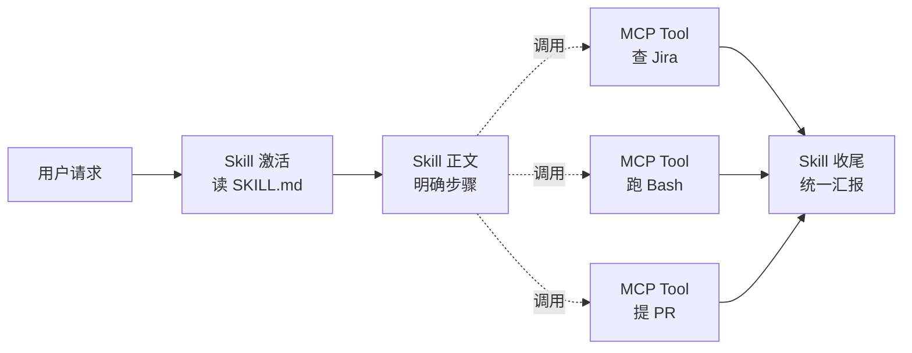
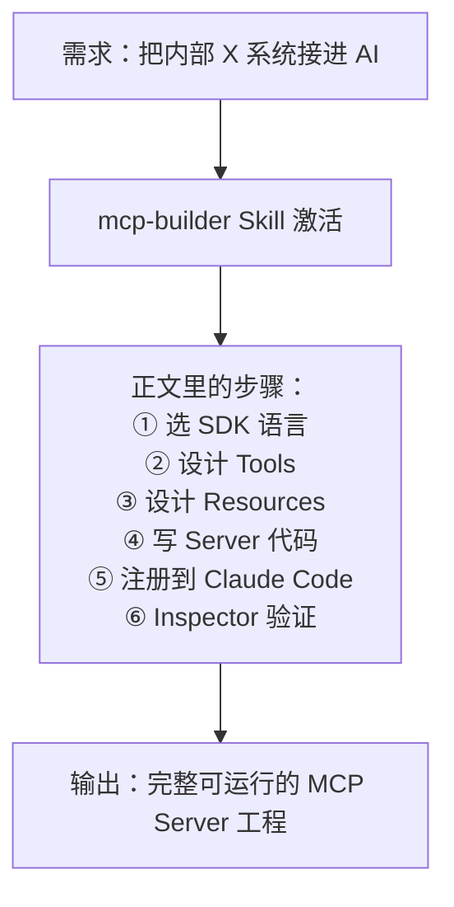

# 03 · 组合范式

MCP 决定能力上限，Skill 决定稳定下限

---
layout: center
---

# 核心论断

<div class="punchline mt-4">
<span class="accent">MCP</span> 决定能力上限 ·
<span class="accent-skill">Skill</span> 决定稳定下限
</div>

<div class="mt-8 max-w-3xl mx-auto text-base text-slate-600">

能力 (MCP) × 稳定 (Skill) = 可交付的协作者。<br>
两者不是同层概念 —— 一个解"<strong>能不能做</strong>"，一个解"<strong>能否每次都做对</strong>"。

</div>

<!-- 演讲者备注：
这是本期的核心论断金句。让听众默念三遍。
反例（提醒避免）："MCP 和 Skill 是两个互替选项"—— 错。它们是不同维度，可单独使用，也可叠加，从不互斥。
-->


---

---
layout: full-vibe
class: 'p-8'
---

# 1. 决策矩阵 · 何时单用 / 何时组合

<div class="mt-3">
  <MCPSkillDecisionMatrix />
</div>

<!-- 演讲者备注：
现场把鼠标 hover 在某一行，整行高亮 + 揭示决策依据。
如果时间紧，挑 3 行讲：① 查工单（MCP 单用）② commit 风格（Skill 单用）③ 看工单→改 bug→提 MR（必须组合）。
-->


---

# 2. 概念全景 · 各司其职

<div class="table-scroll mt-3">

| 概念 | 角色 | 接管什么 | 例子 |
|---|---|---|---|
| **MCP Tool** | 单次能力 | 调外部系统的一次具体动作 | `get_jira_issue` |
| **MCP Resource** | 单次数据 | 把外部数据塞进 Context | `jira://schema` |
| **MCP Prompt** | 模板片段 | 用户主动选的对话起手式 | `/jira-summarize` |
| **Skill** | 工序模板 | 教 AI "这类任务该怎么做" | `release-check` |
| **Sub-agent** | 独立分身 | 独立上下文 + 独立工具集干一个子任务 | `pr-reviewer` 子 agent |
| **Agent (主)** | 总指挥 | 决定何时调 Skill / Tool / Sub-agent | Claude Code 主对话 |

</div>

<div class="mt-3 text-sm text-slate-600">

🎯 这张表理顺了第二期 Harness 容器内的所有角色：MCP 是<strong>能力供给侧</strong>，Skill / Sub-agent 是<strong>调度策略侧</strong>，Agent 是<strong>顶层决策侧</strong>。

</div>

<!-- 演讲者备注：
回应 02.2 的"概念辨析终结篇"。如果听众有人提问"Skill 和 Tool 的区别"，可以指着这张表说：Tool 是 MCP 提供的具体能力（一次动作），Skill 是把多个动作按 SOP 编排起来的工序模板。
-->


---

# 3. 范式 1 · Skill 调 MCP（最常见 ~80%）

<div class="grid grid-cols-2 gap-6 mt-4">

<div>

### 流程



</div>

<div>

### 一个最小例子：`fix-and-pr`

```markdown
---
name: fix-and-pr
description: 根据 Jira 工单修 bug 并提 PR。
  当用户说"修一下 PROJ-XXXX"或贴工单链接时调用。
allowed-tools: Bash(git:*) Bash(npm:test) Read Edit
---

## 步骤
1. 通过 jira MCP `get_jira_issue` 拉工单
2. 创建分支 `fix/PROJ-XXXX`
3. 定位代码、改动、跑 `npm test`
4. 通过 github MCP `create_pull_request` 提 PR
5. PR 描述自动包含工单链接和测试结果
```

</div>

</div>

<div class="mt-3 text-xs text-slate-500">
要点：Skill 决定<strong>顺序与容错</strong>（哪步失败如何 fallback），MCP 提供<strong>每一步的能力</strong>。
</div>

<!-- 演讲者备注：
80% 场景。让听众记住这个心智模型：
- Skill 写"步骤 1 → 步骤 2 → 步骤 N"
- 每步具体怎么做？调 MCP Tool / Bash / Read / Write
- 失败如何 fallback？写在 Skill 的"Common edge cases"章节
04.practice 的 Demo C 就是这个范式的高级版本。
-->


---

# 4. 范式 2 · MCP 暴露 Prompts 给 Skill 引用

<div class="grid grid-cols-2 gap-6 mt-4">

<div class="theme-mcp">

### MCP Server 暴露 Prompt

```python
@mcp.prompt()
def jira_ticket_brief(issue_id: str) -> str:
    """生成给经理汇报的工单简报。"""
    ticket = fetch(issue_id)
    return f"""请根据以下工单生成 3 句汇报：
进展：{ticket.progress}
风险：{ticket.risk}
下一步：{ticket.next}"""
```

* Prompt 是 user-controlled
* 用户敲 `/jira_ticket_brief PROJ-1024` 触发

</div>

<div class="theme-skill">

### Skill 引用 MCP Prompt

```markdown
---
name: weekly-report
description: 周五自动汇总本周做的所有 Jira 工单
---

## 步骤
1. 列出本周 closed 的工单
2. 对每个工单调用
   `mcp:jira/jira_ticket_brief`
   生成简报
3. 汇总成本周报告
```

* Skill 把多个 Prompt 组合成更高阶工序

</div>

</div>

<div class="mt-3 text-sm text-slate-500 text-center">
✨ 这种范式在<strong>跨多个 MCP Server</strong>的复杂工序中价值最大。
</div>

---

# 5. 闭环案例 · `mcp-builder` 元 Skill

<div class="mt-4 grid grid-cols-2 gap-4">

<div>

### 是什么？

> 一个用 Skill 来**生成 MCP Server** 的 Skill。
> 来自 Anthropic / Composio 社区，[awesome-claude-skills](https://github.com/ComposioHQ/awesome-claude-skills) 旗舰之一。

```yaml
name: mcp-builder
description: |
  Build a production-grade MCP server.
  Use when the user wants to wrap an internal API
  / database / SaaS as an MCP server.
allowed-tools: Bash(npm:*) Write Edit Read
```

</div>

<div>

### 工作流



</div>

</div>

<div class="mt-4 p-3 theme-combo text-sm">
🌀 <strong>闭环</strong>：用 Skill 写 MCP，用 MCP 给 Skill 提供新能力 —— Skill / MCP 互相生成、互相增强。
</div>

<!-- 演讲者备注：
讲到这里听众应该能理解为什么 Anthropic / Composio 投入做 mcp-builder 这种"元 Skill"。
现场互动："我们公司想接的内部系统是哪些？" —— 这些都可以通过 mcp-builder 一键生成。
关键：mcp-builder 是个 Skill，不是工具或代码模板 —— 这意味着它可以根据你的具体需求灵活生成，而不是死板套模板。
-->


---

# 6. 团队级沉淀 · 三层加载策略

<div class="mt-3 grid grid-cols-3 gap-3">

<div class="theme-mcp">

### 🌐 全局层

`~/.claude/skills/`

* 个人长期使用的 Skill
* 跨项目通用（如 `commit-message`）
* 个人电脑生效

</div>

<div class="theme-skill">

### 🏢 团队层

内部 Git 仓库 / npm 包

* 团队共享资产
* 通过版本号灰度（`metadata.version`）
* CI 自动同步到成员机器

</div>

<div class="theme-combo">

### 📁 项目层

`.claude/skills/` 在项目根目录

* 项目特有的规范
* 与 `.cursorrules` 互补
* 进 Git，团队成员开箱即用

</div>

</div>

<div class="mt-4 text-sm text-slate-600">

📦 **推荐版本管理策略**：

```yaml
# SKILL.md frontmatter
metadata:
  team: backend-platform
  version: "2.3.1"
  changelog: "https://intra.company.com/skills/release-check"
```

</div>

---

# 7. 三层检查清单（投产前）

<div class="grid grid-cols-3 gap-3 mt-4 text-sm">

<div class="col-good">

### ✅ MCP 层

* [ ] Tool description 含「做什么 + 何时用」
* [ ] inputSchema 严格校验
* [ ] 远程 Server 校验 `Origin` 头
* [ ] OAuth / Bearer 而非长期密钥
* [ ] 返回 `isError` 区分协议 vs 业务错误
* [ ] 通过 MCP Inspector 验证

</div>

<div class="col-good">

### ✅ Skill 层

* [ ] 文件名为 `SKILL.md`，目录名 = `name`
* [ ] description 1024 字内含 what + when
* [ ] 主文件 < 500 行，详细拆 `references/`
* [ ] 含 Common edge cases
* [ ] `allowed-tools` 用空格分隔字符串
* [ ] 通过 `skills-ref validate` 验证

</div>

<div class="col-good">

### ✅ 组合层

* [ ] Skill 与 MCP 边界清晰：Skill 编排 / MCP 执行
* [ ] 每步失败有 fallback / stop 策略
* [ ] 关键操作（提 PR、打 tag）需用户确认
* [ ] 灰度策略：先 5% 用户、再扩大
* [ ] 有 audit log 可追溯
* [ ] 文档同步更新到团队 wiki

</div>

</div>

---
layout: center
---

# 本章小结 · 组合范式

<v-clicks>

1. **核心论断**：MCP 决定能力上限，Skill 决定稳定下限
2. **决策矩阵**：需要伸手 → MCP；需要走流程 → Skill；都要 → 组合
3. **范式 1**：Skill 调 MCP（80% 场景）—— Skill 编排顺序，MCP 提供能力
4. **范式 2**：MCP 暴露 Prompts 给 Skill 引用 —— 复杂跨系统工序
5. **闭环**：mcp-builder 元 Skill 演示 Skill ↔ MCP 互相生成
6. **三层沉淀**：全局 / 团队 / 项目，各司其职

</v-clicks>

<div v-click="7" class="mt-6 punchline">
理论说够了 ——
<br>
下一章：<span class="accent">现场跑三个 Demo</span>。
</div>
