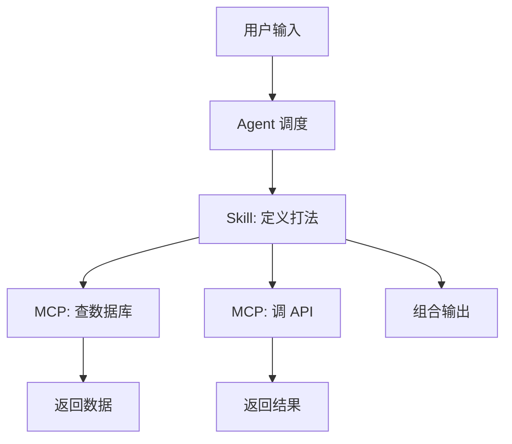

# 03. Integration：MCP + Skill 组合

> **MCP 提供"武器"，Skill 定义"打法"。两者组合 = 完整的工作流自动化。**

## 为什么需要组合？

<v-clicks>

- **MCP**: 让 AI 能访问外部系统（数据库、API、文件系统）
- **Skill**: 让 AI 遵循团队规范，按 SOP 办事
- **组合**: 既有"伸手"能力，又有"动脑"能力

</v-clicks>

---

## 组合模式架构



---

## 实战：发版验收工作流

```yaml
# ~/.claude/skills/release-check.md
---
name: release-check
description: 执行上线前的最终全量检查
allowed-tools: [bash, git, mcp_jira]
---

当用户输入 `/release` 时：
1. 运行 `npm run test:coverage`。低于 80% 立即报错
2. 运行 `npm run build`，检查包大小是否超 5MB
3. 调用 `mcp_jira` 读取 Jira Issue 状态
4. 全部通过后执行 `git tag v{版本号}`
```

<div class="mt-4 p-4 bg-purple-50 border border-purple-200 rounded-lg">
<strong>价值升维</strong>: 我们不再是教 AI "写代码"，而是在教 AI "当研发主管"
</div>

---

## 企业级 Skill 沉淀策略

| 层级 | 位置 | 作用 |
|------|------|------|
| **全局层** | `~/.claude/skills/` | 个人常用技能 |
| **团队层** | 内部 npm 包 | 团队共享资产 |
| **项目层** | `.cursorrules` | 项目特定规范 |

<v-clicks>

1. **从 Wiki 到 Code**: 把团队规范转为 `.cursorrules`
2. **版本化管理**: 用 Git 管理 Skill 资产
3. **渐进式采纳**: 从简单命名规范开始

</v-clicks>

---
layout: center
---

# 本章小结：MCP + Skill 组合

<v-clicks>

1. **MCP = 武器库**: 让 AI 能访问外部系统
2. **Skill = 说明书**: 让 AI 遵循团队规范
3. **1+1>2**: 完整的工作流自动化

</v-clicks>
