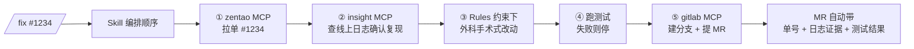

# 03 · 基于研发工作流 · 每个环节的资产

把资产挂到你每天走的工序上 —— 哪个环节缺什么、补什么、怎么补

---

# 一张图：研发工作流 × AI 资产

<div class="table-scroll mt-4 text-sm">

| 环节 | 老痛点 | 主要资产 | 真实来源 |
|---|---|---|---|
| **① 需求 / 意图** | 读不到禅道单、需求模糊就开干 | MCP `zentao` / `atlassian` + Rules 意图确认 | `@nn/mcp-zentao` · `AGENTS.md` |
| **② 编码** | 风格漂移、看不到线上日志 | Rules 编码原则 + MCP `gitlab` / `insight` | `.claude/rules/ai.md` · `@nn/mcp-insight` |
| **③ 评审** | 标准靠口头、漏检反复犯 | Skill `reviewing-prs` + Hook lint 强制 | `review.yaml` · `.review/` |
| **④ 测试** | 改完不补测试、边界漏 | Rules 测试同步 + Skill 自验证 | `AGENTS.md` Phase 4 |
| **⑤ 发布** | 手工 changeset / 打 tag / 通知 | Skill `publish` + MCP `gitlab` | `.claude/skills/publish/` |

</div>

<div class="mt-4 p-2 theme-combo text-sm">
🎯 规律：<strong>MCP 让 AI 看见并伸手到这个环节的系统，Skill / Rules 让 AI 按团队的规矩走这个环节</strong>。下面每屏给你一段能直接抄的起手式。
</div>

<!-- 演讲者备注：
这是本章地图，对应 stageboard 把研发流程拆成节点的思路。逐环节往下讲，每环节"痛点→资产→抄走"三段式，控制在 1 分钟。
-->

---

# stageboard · 把"哪个阶段该补什么资产"摆成一张大盘

<div class="text-sm text-slate-600 mt-1">真实仓库 <code>stageboard</code>：研发流程拆成 10 个阶段节点，每个节点声明 <strong>主力 MCP / Skill + 就绪度</strong>，整体成熟度 <strong>1.6 → 4.5</strong>。</div>

<div class="table-scroll mt-3 text-xs">

| # | 阶段 | Owner | 主力资产 | 就绪度 |
|---|---|---|---|---|
| n01 | 需求分析 | 产品+前端 | `zentao` MCP · PRD Skill | 🟢 ready / ⚪ planned |
| n02 | UI/UX 设计 | 设计+前端 | `figma` MCP · 组件映射 Skill | 🟢 ready / ⚪ planned |
| n03 | 技术方案 | 架构组 | `dev-sop` Skill · `spec-drafter` agent | 🟡 wip |
| n04 | 开发编码 | 各团队 Lead | gitlab/insight MCP×4 · `CLAUDE.md` Rules | 🟢 ready / 🟡 wip |
| n05 | 自测 & 单测 | 前端+QA | `test-first` Skill · CI 覆盖率卡口 | ⚪ planned |
| n06 | Code Review | 架构组+DevOps | `reviewing-prs` Skill · Copilot review | ⚪ planned |
| n07 | 集成测试 | QA | `e2e` Skill · AI 维护用例 | ⚪ planned |
| n09 | 监控运维 | 运维+基建 | 点位日志 MCP · Sentry · AI RCA | 🟡 wip |
| n10 | 文档沉淀 | 架构组 | `CLAUDE.md`/`AGENTS.md`/`SKILLS` · doc MCP | 🟡 wip |

</div>

<div class="mt-3 p-2 theme-combo text-sm">
🎯 用法：<strong>先给每个阶段标就绪度（ready/wip/planned/missing），再按 ROI 排先补哪个</strong> —— 不按流程顺序，按 <code>(AI 收益 × 痛点) / 难度</code> 决定下一个动作。下面挑 ready/wip 的几个阶段细讲。
</div>

<!-- 演讲者备注：
打开 stageboard 截图：把"我团队 AI Native 转型到哪了"工程化成 git-native 大盘（config/nodes/nXX.yaml）。
三点：① 10 个阶段每个都声明主力 MCP/Skill；② 就绪度一眼看到缺口；③ ROI 公式定优先级——别从 n01 顺着做。
承上启下：下面 5 屏挑 ready/wip 的阶段（需求/编码/评审/测试/发布）讲透"怎么用"。
-->

---

# 成熟度阶梯 · 每个阶段都有四级，先知道自己在哪

<div class="grid grid-cols-4 gap-3 mt-5 text-sm">

<div v-click="1" class="chapter-card">

### L1 · 个人自发
<span class="text-xs text-slate-500">成熟度 ~1</span>

个别人私下用 AI 起草<br>
（如个别 PM 用 AI 写 PRD）

</div>

<div v-click="2" class="theme-skill">

### L2 · 团队共享
<span class="text-xs text-slate-500">成熟度 ~2-3</span>

模板/prompt/Skill 进 Git<br>
全员共用同一套（`dev-sop`）

</div>

<div v-click="3" class="theme-mcp">

### L3 · 自动产出
<span class="text-xs text-slate-500">成熟度 ~3-4</span>

AI 自动产初稿 + 人工修订<br>
（Figma→Vue 自动出 PR）

</div>

<div v-click="4" class="theme-combo">

### L4 · AI 主导
<span class="text-xs text-slate-500">成熟度 ~4.5</span>

AI 主导、人只做关键决策<br>
（AI 主导 CR，人看高风险）

</div>

</div>

<div v-click="5" class="mt-6 p-3 theme-combo text-sm">
🔑 资产的作用 = <strong>推着每个阶段往上爬一级</strong>：Rules/Skill 把 L1 的个人技巧固化成 L2 团队标准；MCP 把 L2 的人工动作升级成 L3 自动产出。<strong>先评估再补</strong>，别一上来就奔 L4。
</div>

<!-- 演讲者备注：
stageboard 内置的四级成熟度模型，对应每个节点 maturity 字段。
让听众对号入座——你团队的 code review 在哪级？多数在 L1（口头）或 L2（有清单）。
注意区分：这里的 L1-L4 是"阶段成熟度"，和第一期的 L1-L8 自主性等级不是一回事。
-->

---

# ① 需求 / 意图 · 让 AI 看见禅道，并先对齐再动手

<div class="grid grid-cols-2 gap-5 mt-3">

<div class="col-bad">

### ❌ 现在

* 复制粘贴禅道单号、描述给 AI
* 需求一句"加个登录"，AI 直接按自己理解写
* 上下文丢失，越改越偏

</div>

<div class="col-good">

### ✅ 用 MCP + Rules

* `@nn/mcp-zentao` 让 AI **直接读单**：
  `> 看下禅道 #1234，按描述实现`
* `AGENTS.md` 的**意图确认协议**强制 AI 先复述：
  *"我理解需求是 […]，确认无误吗？"*

</div>

</div>

<div class="mt-4">

**抄走 · `.mcp.json`（把内部禅道接进任何 AI 客户端）**

```json
{ "mcpServers": {
  "zentao": {
    "command": "npx",
    "args": ["-y", "--registry=http://172.31.4.4:4873/", "@nn/mcp-zentao"],
    "env": { "ZENTAO_URL": "https://zentao.nn.com",
             "ZENTAO_USERNAME": "${ZENTAO_USERNAME}", "ZENTAO_PASSWORD": "${ZENTAO_PASSWORD}" }
  }
}}
```

</div>

<!-- 演讲者备注：
现场演示：claude 里直接说"看下禅道 #xxxx"，AI 自动拉单 + 复述确认。
强调 AGENTS.md 的"歧义零容忍" —— Rules 资产挡掉返工的最高 ROI 点。
-->

---

# ② 编码 · 钉住团队风格 + 让 AI 自己查日志

<div class="grid grid-cols-2 gap-5 mt-3">

<div class="col-good">

### Rules 资产 · 每次都生效

`.claude/rules/ai.md` 的**编码四原则**（节选）：

* **编码前先思考**：不确定立即提问，列出所有理解
* **简单优先**：200 行能用 50 行解决就重写
* **外科手术式修改**：只改该改的，别顺手重构
* 不靠口头传，进 Git 自动加载

</div>

<div class="col-good">

### MCP 资产 · 让 AI 伸手取证

* `@nn/mcp-gitlab`：读分支 / 提交 / MR diff
* `@nn/mcp-insight`：查 Kibana 线上日志
  `> 这个空指针在生产有没有报？查下 insight`

AI 不再"凭空猜"，而是**取证后再改**。

</div>

</div>

<div class="mt-4 p-3 theme-combo text-sm">
💡 这一环的精髓 = <strong>Rules 管"怎么写"（规矩） + MCP 管"看见什么"（证据）</strong>。
风格漂移和瞎猜，是编码环节两个最大返工源，分别由这两类资产解决。
</div>

<!-- 演讲者备注：
Rules 是最被低估的资产 —— 不性感，但每天每轮都在挡错。读两条 ai.md 原则给大家看。
insight MCP 演示：AI 改 bug 前先查线上日志确认复现，而不是猜。
-->

---

# ③ 评审 · 把"老司机的眼睛"写成 Skill

<div class="grid grid-cols-2 gap-5 mt-3">

<div class="col-bad">

### ❌ 口头标准

* "记得看下 SQL 注入啊" —— 全凭自觉
* 每个 reviewer 标准不一
* 新人不知道该看什么

</div>

<div class="col-good">

### ✅ Skill 固化 SOP + Hook 强制

* `reviewing-prs` Skill：把"必查清单"写进 SOP，**说"审一下这个 PR"自动激活**
* `review.yaml` / `.review/`：团队 review 规则配置化
* Hook：`edit` 后自动 `lint`，不合规直接挡回

</div>

</div>

<div class="mt-4 p-3 theme-combo text-sm">
这个 <code>reviewing-prs</code> Skill <strong>怎么从 0 建出来、怎么验证它会被触发</strong> —— 第 <strong>05 章</strong>带你完整走一遍。这里先看它在评审环节解决了什么。
</div>

<!-- 演讲者备注：
Skill 的价值 = 把资深工程师脑子里的"必查清单"冻结下来，新人开箱即用同一套眼睛。
完整构建（命名/description/dry-run/拆 references/进 Git）放第 05 章实战，这里不展开 YAML，避免重复。
-->

---

# ④ 测试 · 让"改完就补测试"变成默认动作

<div class="grid grid-cols-2 gap-5 mt-3">

<div class="col-good">

### Rules · 测试同步（AGENTS.md Phase 4）

* **生成功能代码的同时，必须检查 / 生成对应测试**
* 自检清单（AI 输出后自动跑一遍）：
  * [ ] 处理了空值 / 边界？
  * [ ] 引入新类型错误？
  * [ ] 有多余 console.log？

</div>

<div class="col-good">

### Skill · 自验证工序（反馈闭环）

* 把"跑测试 → 看覆盖率 → 补缺失分支"写成 Skill
* **校验→修→再校验** 的反馈闭环（官方推荐模式）
* 失败有明确 fallback：覆盖率 < 阈值 → **停下问人**，不硬过

</div>

</div>

<div class="mt-4 p-3 theme-combo text-sm">
🧠 关键心法：把"<strong>什么情况下该停下来问人</strong>"写进资产。
AI 最危险的不是不会做，是<strong>错了还硬着头皮往下做</strong> —— Rules / Skill 的容错段就是给它装刹车。
</div>

<!-- 演讲者备注：
测试环节重点不是教写测试，是讲"自验证 + 反馈闭环 + 刹车"。AGENTS.md Phase 4 的自检清单照搬即可。
反馈闭环（validator→fix→repeat）是官方 best-practices 明确推荐的提质模式。
-->

---

# ⑤ 发布 · 把发版工序整个交给 AI

<div class="grid grid-cols-2 gap-5 mt-3">

<div class="col-bad">

### ❌ 手工发版

分析变更 → 定版本号 → 写 changeset → 打 tag → 推送 → 等 CI
—— 一步错全重来，每人记的流程还不一样

</div>

<div class="col-good">

### ✅ `publish` Skill（nn-ai 真实在用）

```yaml
name: publish
description: master 分支自动分析变更 → 推荐版本 →
  创建 changeset → 执行 npm run release:all 推送。
disable-model-invocation: true   # 只允许显式触发，防误发
```

前置检查（分支 / 工作区 / 网络）→ 变更分析 → 版本推荐 → **用户确认** → 执行。

</div>

</div>

<div class="mt-4 text-sm">

真实输出（来自 `publish/SKILL.md`）：

```
📦 @nn/ai-kit:      2.5.2 → 2.6.0 (minor) — feat: 自动检测凭据
📦 @nn/mcp-insight: 0.4.0 → 0.4.1 (patch) — fix: 移除启动强制校验
确认发布？Y 继续 / N 取消 / 指定版本
```

</div>

<div class="mt-2 text-xs text-slate-500">
注意 <code>disable-model-invocation: true</code>：发布这种高危操作，<strong>只许人显式 <code>/publish</code> 触发</strong>，不让模型自作主张激活。
</div>

<!-- 演讲者备注：
强调三点：① 整条发版工序变成一个 Skill；② 高危操作用 disable-model-invocation + 用户确认双保险；③ 流程变更只改 SKILL.md 一处，全员同步。
这就是"教 AI 当 release manager"。
-->

---

# 把环节串起来 · 何时单用，何时组合

<div class="text-sm text-slate-600 mt-1">上面每个环节多是单一资产解决一个点；真实任务往往要把它们<strong>编排成一条龙</strong>。先看选择规律：</div>

<div class="mt-2">
  <MCPSkillDecisionMatrix />
</div>

<!-- 演讲者备注：
hover 某行整行高亮。挑三行讲：查工单(MCP单用) / commit 风格(Rules单用) / 看单→改→提MR(必须组合)。
口诀：缺能力补 MCP，缺规矩补 Skill/Rules，要一条龙就编排。
-->

---

# 真实一条龙 · 修一个生产 bug

<div class="mt-3">



</div>

<div class="mt-4 grid grid-cols-2 gap-5 text-sm">

<div class="theme-skill">

### Skill 负责"顺序与容错"

哪步先做、哪步失败怎么停 —— 写在一个 `fix-from-ticket` Skill 里

</div>

<div class="theme-mcp">

### MCP 负责"每步的能力"

zentao 拉单 · insight 查日志 · gitlab 提 MR —— 三个 Server 各管一段

</div>

</div>

<div class="mt-3 p-2 theme-combo text-sm">
🔑 一句话记住：<strong>Skill 是剧本，MCP 是演员，Rules 是片场纪律</strong>。三者合演才完成一个真实任务。
</div>

<!-- 演讲者备注：
把前面五个环节串成一条龙的真实例子，全部用 nn-ai 已有的 MCP。
强调 MR 自动带上"单号+日志证据+测试结果" —— review 友好、可审计的交付物。
-->

---
layout: center
---

# 组合的两条铁律

<div class="mt-8 space-y-6 text-lg max-w-3xl mx-auto">

<div v-click="1">
<strong class="accent-skill">① 编排与执行分离</strong><br>
<span class="text-base text-slate-600">Skill 只写"步骤 1→2→3 + 失败怎么办"，绝不在 Skill 里硬编码实现 —— 真正干活交给 MCP / Bash。</span>
</div>

<div v-click="2">
<strong class="accent">② 高危操作留人工闸门</strong><br>
<span class="text-base text-slate-600">提 MR、打 tag、发版 —— 一律先给用户确认；高危 Skill 用 <code>disable-model-invocation</code> 禁止模型自激活。</span>
</div>

</div>

<!-- 演讲者备注：
两条铁律是组合不翻车的底线。第一条防"Skill 变成代码库"，第二条防"AI 自作主张干危险事"。
（更系统的反模式清单在第 04 章）
-->
