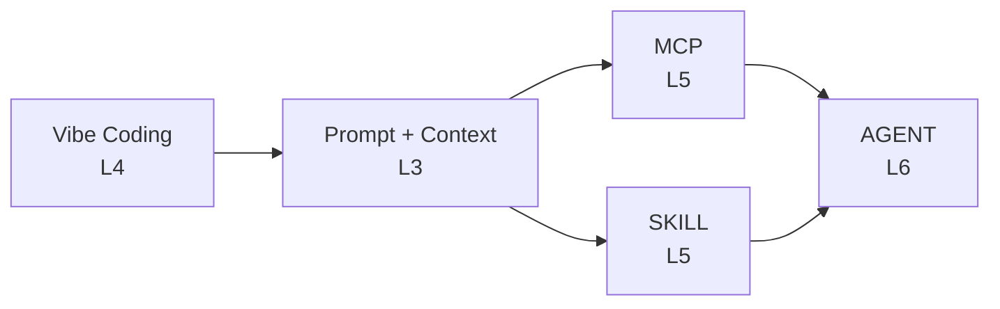

# AI Coding 演讲目录

## 背景

会话旨在帮助团队理解并实践如何在日常开发中有效使用 AI 工具，提升工程效率，并建立稳定的 AI 辅助开发工作流。

## 演讲对象

- 公司内部研发涉及
  - 前端
  - 后端
  - Android/iOS
  - C++
- 产品/测试（可旁听）

---

## 演讲时间安排

| 序号 | 主题 | 日期 | 星期 | 讲师 | 状态 |
|------|------|------|------|------|------|
| 1 | Vibe Coding (氛围编程) | 2026-03-16 | 周一 | 程乐 | 待进行 |
| 2 | MCP (Model Context Protocol) | 2026-04-16 | 周四 | 程乐 | 待进行 |
| 3 | Prompt + Context Engineering | 2026-05-15 | 周五 | 程乐 | 待进行 |
| 4 | SKILL 工作流编排 | 2026-06-16 | 周二 | 程乐 | 待进行 |
| 5 | AGENT 智能体 | 2026-07-16 | 周四 | 程乐 | 待进行 |

---

## 演讲系列总览

| 期数 | 系列名称 | 状态 | 预计时长 | 核心目标 | 能力等级 |
|-----|---------|------|---------|---------|---------|
| 第一期 | Vibe Coding | 待进行 | 95min | 掌握 AI 辅助编程核心理念与协作方式 | L4 |
| 第二期 | Prompt + Context Engineering | 待进行 | 90min | 掌握提示词工程与上下文工程核心框架 | L3 |
| 第三期 | MCP | 待进行 | 90min | 深入理解 MCP 协议架构，能够开发生产级 MCP Server | L5 |
| 第四期 | SKILL | 待进行 | 90min | 掌握 Skill 开发与工作流编排，具备实操能力 | L5 |
| 第五期 | AGENT | 待进行 | 90min | 基于 Agent Loop 原理，具备搭建生产级 Agent 能力 | L6 |

---

## 能力等级说明

参考 [vibe-coding/01.overview.md](./vibe-coding/01.overview.md#L100) 中的 L1-L8 能力模型：

- **L1-L2**: 基础使用 - 会用 AI 工具进行简单对话
- **L3**: Prompt/Context 工程 - 能够优化提示词提升输出质量，管理上下文
- **L4**: 集成应用 - 能够在开发流程中有效使用 AI 工具
- **L5**: 能力扩展 - 能够通过 MCP/Skill 扩展 AI 能力
- **L6**: 任务编排 - 能够构建 Agent 处理复杂任务
- **L7-L8**: 系统架构 - 能够设计 AI 辅助开发体系

---

## 各系列详情

### 第一期：Vibe Coding

**文件位置**: `./vibe-coding/`

**章节结构**:
- `01.overview.md` - Vibe Coding 概述
- `02.principle.md` - 核心原理
- `03.features.md` - 功能特性
- `04.practice.md` - 实战演练
- `05.QA.md` - 问答

---

### 第二期：Prompt + Context Engineering

**文件位置**: `./prompt/`

**章节结构**:
- `01.intro.md` - LLM 核心概念（Token、Context Window、Transformer）
- `02.prompt.md` - Prompt 工程（ICIO、Zero-shot、Few-shot、CoT）
- `03.context.md` - Context 工程（RAG、记忆机制）
- `04.tool-calling.md` - 工具调用最佳实践
- `05.case.md` - 实战案例
- `06.QA.md` - 问答

---

### 第三期：MCP

**文件位置**: `./mcp/`

**章节结构**:
- `01.intro.md` - MCP 概述
- `02.architecture.md` - 架构设计
- `03.protocol.md` - 协议详解
- `04.server-ts.md` - Server 开发 TypeScript
- `05.server-python.md` - Server 开发 Python
- `06.tool.md` - 工具集成
- `07.practice.md` - 实战案例
- `08.QA.md` - 问答

---

### 第四期：SKILL

**文件位置**: `./skill/`

**章节结构**:
- `01.intro.md` - SKILL 概述
- `02.builtin.md` - 内置技能
- `03.custom.md` - 自定义 Skill
- `04.ecosystem.md` - 技能生态（GitHub 900+ Skills）
- `05.practice.md` - 实战案例
- `06.QA.md` - 问答

---

### 第五期：AGENT

**文件位置**: `./agent/`

**章节结构**:
- `01.intro.md` - AGENT 概述
- `02.loop.md` - Agent Loop（核心）
- `03.architecture.md` - 架构设计
- `04.framework.md` - 框架对比
- `05.practice.md` - 实战案例
- `06.QA.md` - 问答

---

## 核心参考资源汇总

### Prompt + Context Engineering
- [Prompt Engineering Guide](https://www.promptingguide.ai/zh)
- [Anthropic Courses](https://github.com/anthropics/courses)
- [OpenAI Prompt Best Practices](https://platform.openai.com/docs/guides/prompt-engineering)

### MCP
- [MCP 官方文档](https://modelcontextprotocol.io)
- [MCP SPEC](https://spec.modelcontextprotocol.io)
- [Microsoft MCP for Beginners](https://github.com/microsoft/mcp-for-beginners)
- [Awesome MCP Servers](https://github.com/punkpeye/awesome-mcp-servers)

### SKILL
- [Claude Code 官方文档](https://code.claude.com/docs/en/overview)
- [Claude Code Skills](https://code.claude.com/docs/en/skills)
- [awesome-claude-skills](https://github.com/ComposioHQ/awesome-claude-skills)
- [awesome-claude-code](https://github.com/hesreallyhim/awesome-claude-code)
- [anthropics/claude-plugins-official](https://github.com/anthropics/claude-plugins-official)

### AGENT
- [Claude Code Agent 文档](https://code.claude.com/docs/en/sub-agents)
- [Anthropic Agent SDK](https://docs.anthropic.com/en/docs/agents-sdk/overview)
- [LangChain](https://github.com/langchain-ai/langchain)
- [AutoGen](https://github.com/microsoft/autogen)
- [CrewAI](https://github.com/crewAIInc/crewAI)

---

## 优化事项（基于 Vibe Coding 最佳实践）

### 交互式组件开发

| 序号 | 系列 | 优化项 | 参考 vibe-coding | 优先级 | 状态 |
|-----|------|-------|-----------------|-------|------|
| 1 | MCP | 创建 MCPWorkflow.vue 交互式工作流组件 | VibeWorkflow.vue | P1 | ✅ 已完成 |
| 2 | Agent | 创建 AgentLoop.vue 交互式工作流组件 | VibeWorkflow.vue | P1 | ✅ 已完成 |
| 3 | 所有系列 | 创建 ContextWindow.vue 上下文窗口可视化 | ContextWindow.vue | P2 | 待处理 |

### 内容优化

| 序号 | 系列 | 优化项 | 参考 vibe-coding | 优先级 | 状态 |
|-----|------|-------|-----------------|-------|------|
| 4 | Prompt | 添加结构化 Prompt 格式示例（XML/Markdown） | 02.principle.md | P1 | ✅ 已完成 |
| 5 | Agent | 添加 Agent Loop 代码示例 | 02.loop.md | P1 | ✅ 已完成 |
| 6 | 所有系列 | 添加故障排除/Troubleshooting 章节 | vibe-coding 实践 | P2 | ✅ 已完成 |
| 7 | Prompt/Context | 优化 RAG 可视化解释 | 02.principle.md | P2 | ✅ 已完成 |
| 8 | MCP | 补充配置步骤详细说明 | 02.principle.md | P2 | ✅ 已完成 |
| 9 | Agent | 框架对比增加代码示例 | 04.framework.md | P2 | ✅ 已完成 |

### 布局优化

| 序号 | 系列 | 优化项 | 参考 vibe-coding | 优先级 | 状态 |
|-----|------|-------|-----------------|-------|------|
| 10 | 所有新系列 | 采用 vibe-step 布局实现分步讲解 | 02.principle.md | P1 | ✅ 已完成（MCP/Agent已添加组件） |
| 11 | 所有新系列 | 添加幻灯片点击交互效果 | v-clicks | P1 | ✅ 已完成 |
| 12 | 所有新系列 | 对齐 slides.md 入口结构 | slides.md | P2 | ✅ 已完成 |

### Vibe Coding 最佳实践技术细节

**交互组件参考**:
- `VibeWorkflow.vue`: 展示 10 步 AI Coding 工作流，每步可点击查看详情
- `ContextWindow.vue`: 展示上下文窗口组成（system, user, file, plan, diff, lint, error）

**布局配置**:
- `layout: full-vibe` + `clicks: N`: 完整工作流展示
- `layout: vibe-step` + `activeStep: xxx`: 分步骤讲解
- `v-click` / `v-clicks`: 点击显示效果

**参考文件**:
- `/ppts/vibe-coding/components/VibeWorkflow.vue`
- `/ppts/vibe-coding/components/ContextWindow.vue`
- `/ppts/vibe-coding/02.principle.md`

---

## 学习路径与知识衔接

### 系列间依赖关系

### 各系列核心技能

| 系列 | 核心技能 | 工具/框架 |
|------|---------|----------|
| Vibe Coding | AI 协作理念 | Cursor, Claude Code |
| Prompt + Context | 提示词优化 | ICIO, CoT, RAG |
| MCP | 能力扩展 | @modelcontextprotocol/* |
| SKILL | 工作流编排 | Claude Code Skills |
| AGENT | 任务编排 | LangChain, AutoGen |

### 推荐学习顺序

1. **第一阶段**: Vibe Coding (L4) - 建立 AI 协作思维
2. **第二阶段**: Prompt + Context (L3) - 掌握交互技巧
3. **第三阶段**: MCP/SKILL (L5) - 扩展 AI 能力
4. **第四阶段**: AGENT (L6) - 构建智能系统

### 术语对照表

| 英文 | 中文 | 所属系列 |
|------|------|---------|
| Token | 令牌 | Prompt |
| Context Window | 上下文窗口 | Prompt |
| Transformer | Transformer 架构 | Prompt |
| RAG | 检索增强生成 | Prompt/Context |
| MCP | 模型上下文协议 | MCP |
| Tool Calling | 工具调用 | MCP/SKILL |
| Agent Loop | Agent 循环 | AGENT |
| ReAct | 推理+行动 | AGENT |
