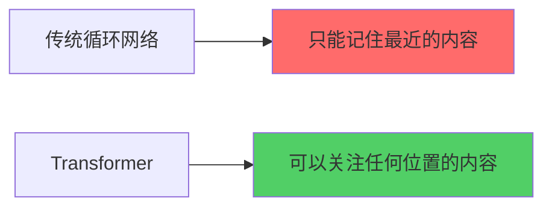
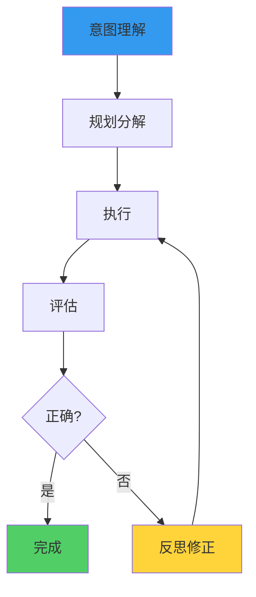
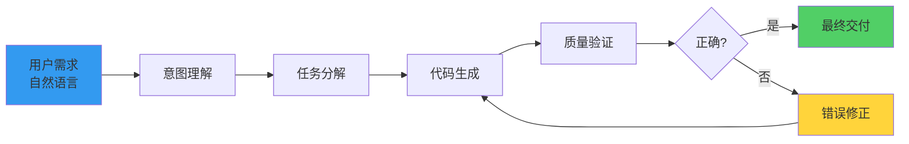
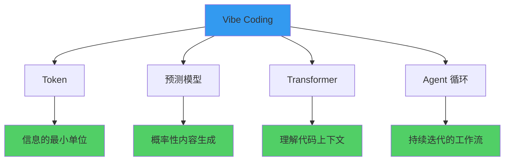

<VibeWorkflow />

---


# Token

**Token 是 AI 处理信息的最小单位**

你可以把它理解为"词"——但不是语言学意义上的词，而是模型切分文本的基本单位。

---

# Token 示例

```python
"function add(a, b) { return a + b; }"
```

切分后：

```
["function", " add", "(", "a", ",", "b", ")", " {", 
 " return", " a", " +", " b", " }"]
```

---

# 为什么 Token 重要

<div class="grid grid-cols-2 gap-6">

<div v-click>

### 1. Token 数量 = 思考的复杂度

- 模型一次能处理的 Token 数量是有限的（上下文窗口）
- 上下文窗口限制了 AI 能"记住"的内容量

</div>

<div v-click>

### 2. Token 消耗 = 成本

- API 定价通常是按 Token 数量计费的
- 优化提示词的本质是减少不必要的 Token 消耗

</div>

</div>

---

# Token 边界 = 能力边界

```typescript
// 代码比自然语言更适合 AI 处理
// 因为代码的 Token 边界更清晰

// 这就是为什么 Copilot 类工具
// 在代码补全上效果特别好的原因
```

---

# 03 核心概念二：预测模型

## AI 是如何"生成"内容的

AI 并不"理解"代码，它做的是：**预测下一个最可能出现的 Token**

---

# 预测模型工作原理

```typescript
输入: "function add(a, b) {"
       ↓
预测: " return"  (概率 45%)
     " console"  (概率 20%)
     " const"    (概率 15%)
     ...
```

这个过程称为 **自回归生成**

---

# 预测模型的三个关键特征

<div v-click>

### 1. 概率性

AI 输出的是概率分布，不是确定答案。同一个输入，可能生成多种合理的代码。

</div>

<div v-click>

### 2. 涌现能力

当模型规模足够大时，会出现"理解"代码结构的能力。

```
代码补全 → 代码审查 → 代码生成 → 代码解释
```

</div>

<div v-click>

### 3. 上下文学习

通过在提示词中提供示例，模型可以学习新任务，不需要重新训练。

</div>

---

# 04 核心概念三：Transformer

## 为什么是 Transformer

**Transformer 是当前主流 AI 模型的核心架构**

简单理解：Transformer 让模型能够"关注"输入中最重要的部分

---

# Transformer 的能力对比



---

# Transformer 对编程的意义

<div class="grid grid-cols-2 gap-6">

<div v-click>

### 长程依赖理解

- 模型可以理解整个代码文件的结构
- 知道这个变量在哪里定义，在哪里被使用

</div>

<div v-click>

### 代码上下文感知

- 能够理解函数签名、类型注解、代码风格
- 生成与现有代码风格一致的代码

</div>

</div>

---

# 多模态理解能力

```typescript
// 现代模型可以同时理解：

interface MultiModal {
  code: string;        // 代码
  naturalLanguage: string;  // 自然语言
  fileStructure: string;    // 文件结构
}

// 支持对话式编程、代码审查、文档生成等场景
```

---

# 05 核心概念四：Agent 循环

## 单次交互的局限

```typescript
// 单纯的 LLM 调用：

用户 → 一次性提示 → LLM → 一次性回复
```

### 问题

- 复杂任务无法一次完成
- 遇到错误无法自我修正
- 缺乏执行和验证能力

---

# Agent 循环的力量

**Agent = LLM + 工具 + 循环 + 记忆**



---

# Agent 循环的核心要素

| 要素 | 说明 |
|:---|:---|
| **工具调用** | Agent 可以调用外部工具（搜索、计算、代码执行） |
| **迭代优化** | 通过"生成-验证-修正"循环逐步逼近正确结果 |
| **状态记忆** | 记住之前的尝试和结果，避免重复犯错 |

---

# 06 概念整合：Vibe Coding 工作流程

## 完整的工作流程



---

# 开发者在这个流程中的角色

| 阶段 | AI 擅长 | 人擅长 |
|:---|:---|:---|
| 需求理解 | ✅ 理解模糊描述 | ✅ 明确业务目标 |
| 代码生成 | ✅ 快速生成代码 | ❌ 需要审核 |
| 错误修正 | ✅ 根据反馈调整 | ✅ 判断修正方向 |
| 质量保证 | ⚠️ 有限 | ✅ 最终把关 |
| 架构设计 | ⚠️ 简单场景 | ✅ 复杂系统 |

---

# 07 原理如何指导实践

## 基于原理的实践智慧

<div class="grid grid-cols-2 gap-6">

<div v-click>

### 提示词工程

- 清晰的上下文 → 更好的预测 → 更准的输出
- 具体示例 > 抽象描述

</div>

<div v-click>

### 代码生成

- 小的、具体的任务 > 大的、模糊的需求
- 分步骤生成 > 一次生成整个系统

</div>

</div>

---

# Agent 使用原则

<div class="grid grid-cols-2 gap-6">

<div v-click>

### 给 Agent 明确的验证标准

让 Agent 知道什么是对的，什么是错的

</div>

<div v-click>

### 允许 Agent 试错，但要及时反馈

迭代优化的前提是有效的反馈机制

</div>

</div>

---

# 局限性认知

- **AI 不理解业务逻辑**，需要人工把控
- **复杂架构设计仍需人类专家**
- AI 是强大的工具，但不是万能的解决方案

---

# 08 总结

## 本章要点回顾



---

# 这对你意味着什么

| 思维模式 | 实践指导 |
|:---|:---|
| **Token 思维** | 注意提示词的效率和清晰度 |
| **预测思维** | 理解 AI 输出的概率性，学会引导和筛选 |
| **上下文思维** | 提供足够的背景信息，让 AI 理解你的代码 |
| **循环思维** | 把复杂任务分解为多轮交互，善用 Agent 的迭代能力 |

---

# 理解原理的目的

理解这些原理不是为了成为 AI 专家，而是帮助你更有效地与 AI 协作。

<div class="text-center mt-10">

### 下一章

我们将把这些原理应用到实际的代码生成场景中

</div>

---

# Q&A

<div class="text-center">

有什么问题吗？

</div>
