# 实战演示（Demo）

本演示为短流程示例，目标是展示如何在 Vibe Coding 中与 AI 协作完成一项小任务。

---

## 示例任务：实现并测试一个节流（throttle）函数

### Step 1: 说明任务

**Driver**：我需要一个 `throttle(fn, wait)` 实现，要求：

- 在高频触发下，每隔 `wait` 毫秒只执行一次
- 保留立即执行选项 (leading/trailing)
- 提供 `cancel()` 方法

请给出实现并提供 Jest 测试用例。

---

### Step 2: 发送 Prompt 给 AI

```
请实现一个 JavaScript 的 `throttle(fn, wait, options)` 函数：

- `fn`：要节流的函数
- `wait`：间隔毫秒
- `options` 可选，{ leading: boolean, trailing: boolean }

要求：
1. 函数返回一个有 `cancel()` 方法的包装函数
2. leading: true 时，首次调用立即执行
3. trailing: true 时，最后一次调用会在 wait 后执行
4. 提供完整的 Jest 测试用例，覆盖 leading/trailing 行为和 cancel
```

---

### Step 3: AI 返回的实现

```javascript
function throttle(fn, wait, options = {
  leading: true, 
  trailing: true
}) {
  let timer = null;
  let lastArgs = null;
  let lastThis = null;
  let lastCallTime = 0;

  function invoke() {
    fn.apply(lastThis, lastArgs);
    lastArgs = lastThis = null;
  }

  const wrapper = function(...args) {
    const now = Date.now();
    lastArgs = args;
    lastThis = this;
    
    if (!timer && options.leading) {
      invoke();
      lastCallTime = now;
    }
    if (!timer && options.trailing) {
      timer = setTimeout(() => {
        timer = null;
        if (lastArgs) invoke();
      }, wait);
    }
  };
  // ...
```

::right::

<div style="padding-left: 20px;">

```javascript
  // ... 续

  wrapper.cancel = function() {
    if (timer) clearTimeout(timer);
    timer = null;
    lastArgs = lastThis = null;
  };

  return wrapper;
}

module.exports = { throttle };
```

<div style="margin-top: 20px; padding: 16px; background: #f0f9ff; border-radius: 8px; border-left: 4px solid #0ea5e9;">

**💡 AI 说明**：

这个实现支持 leading 和 trailing 两种模式：

- `leading: true` 首次调用立即执行
- `trailing: true` 最后触发会延迟执行
- `cancel()` 用于清理定时器

</div>

</div>

---

### Step 4: AI 生成的 Jest 测试

```javascript
const { throttle } = require('./throttle');

describe('throttle', () => {
  jest.useFakeTimers();
  
  test('leading: true - 首次调用立即执行', () => {
    const fn = jest.fn();
    const throttled = throttle(fn, 100, { leading: true, trailing: false });
    
    throttled();
    expect(fn).toHaveBeenCalledTimes(1);
  });

  test('trailing: true - 最后一次调用延迟执行', () => {
    const fn = jest.fn();
    const throttled = throttle(fn, 100, { leading: false, trailing: true });
    
    throttled();
    throttled();
    expect(fn).not.toHaveBeenCalled();
    
    jest.advanceTimersByTime(100);
    expect(fn).toHaveBeenCalledTimes(1);
  });

  test('cancel - 取消待执行的调用', () => {
    const fn = jest.fn();
    const throttled = throttle(fn, 100, { leading: false, trailing: true });
    
    throttled();
    throttled.cancel();
    jest.advanceTimersByTime(100);
    expect(fn).not.toHaveBeenCalled();
  });
});
```

---

### Step 5: 验证与合入

<div style="display: grid; grid-template-columns: repeat(3, 1fr); gap: 20px; margin-top: 20px;">

<div style="padding: 20px; background: linear-gradient(135deg, #667eea 0%, #764ba2 100%); border-radius: 12px; color: white;">

**🧪 Driver 运行测试**

```bash
npm test throttle.test.js
```

确认所有测试通过

</div>

<div style="padding: 20px; background: linear-gradient(135deg, #11998e 0%, #38ef7d 100%); border-radius: 12px; color: white;">

**👀 Navigator 验证逻辑**

- 检查边界条件处理
- 确认 this 绑定正确
- 验证内存泄漏风险

</div>

<div style="padding: 20px; background: linear-gradient(135deg, #fc5c7d 0%, #6a82fb 100%); border-radius: 12px; color: white;">

**📝 团队讨论并收录**

- 补充 edge case
- 将 prompt 存入知识库
- 标注使用场景

</div>

</div>

---

# Demo 小结

<div style="display: flex; gap: 30px; margin-top: 30px;">

<div style="flex: 1; padding: 24px; background: #1e1e2e; border-radius: 12px; color: #cdd6f4;">

### ✅ 本次演示涵盖

- 如何把任务拆解为清晰 prompt
- AI 生成代码的典型结构
- 人工校验的关键步骤
- 测试驱动的开发闭环

</div>

<div style="flex: 1; padding: 24px; background: #1e1e2e; border-radius: 12px; color: #cdd6f4;">

### 🔄 完整闭环流程

```mermaid
graph LR
    A[任务描述] --> B[Prompt 构建]
    B --> C[AI 生成]
    C --> D[人工校验]
    D --> E[测试运行]
    E --> F[合入主干]
    F --> G[知识库收录]
```



</div>

</div>

<br/>

> 💡 **记住**：AI 是你的结对编程伙伴，但最终决策权在你手中！
