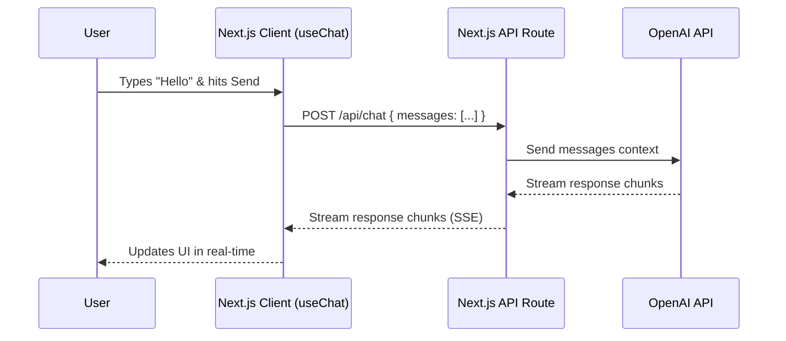

# Project Tutorial: Build Your First AI Chatbot

**Level**: Beginner
**Time**: 30-45 minutes
**Stack**: Next.js 14, Vercel AI SDK, OpenAI

## Introduction

In this tutorial, you will build a fully functional AI chatbot that looks and feels like ChatGPT. You will learn the core concepts of AI engineering: **API communication**, **Streaming**, and **State Management**.

**What you'll build**:
- A clean, responsive chat interface
- Real-time text streaming (typing effect)
- Auto-scrolling message list
- Error handling for API issues

[View Live Demo](#) | [View Source Code](#)

## Prerequisites

- Node.js 18+ installed
- An OpenAI API Key ([Get one here](https://platform.openai.com/api-keys))
- A code editor (VS Code recommended)

## Architecture

We will use the **Vercel AI SDK**, which handles the complex parts of streaming for us.



---

## Step 1: Create a New Next.js Project

Open your terminal and run:

```bash
npx create-next-app@latest my-ai-chatbot
# Select the following options:
# - TypeScript: Yes
# - ESLint: Yes
# - Tailwind CSS: Yes
# - src/ directory: Yes
# - App Router: Yes
# - Import alias: @/*
```

Navigate into your folder:

```bash
cd my-ai-chatbot
```

## Step 2: Install Dependencies

We need the Vercel AI SDK and the OpenAI SDK.

```bash
npm install ai openai
```

## Step 3: Configure Environment Variables

Create a file named `.env.local` in the root of your project:

```env
OPENAI_API_KEY=sk-your-openai-key-here
```

> **Security Warning**: Never commit this file to Git! The `.env.local` file is already in your `.gitignore` by default.

## Step 4: Create the API Route

This backend route will act as a secure proxy between your user and OpenAI.

Create `src/app/api/chat/route.ts`:

```typescript
import { openai } from '@ai-sdk/openai';
import { streamText } from 'ai';

// Allow streaming responses up to 30 seconds
export const maxDuration = 30;

export async function POST(req: Request) {
  const { messages } = await req.json();

  const result = await streamText({
    model: openai('gpt-4o'),
    messages,
  });

  return result.toDataStreamResponse();
}
```

## Step 5: Build the Chat Interface

Now for the frontend. We'll use the `useChat` hook, which automatically handles:
- Sending the message
- Streaming the response
- Updating the message history state

Replace `src/app/page.tsx` with:

```tsx
'use client';

import { useChat } from 'ai/react';

export default function Chat() {
  const { messages, input, handleInputChange, handleSubmit } = useChat();

  return (
    <div className="flex flex-col w-full max-w-md py-24 mx-auto stretch">
      {messages.length > 0 ? (
        messages.map(m => (
          <div key={m.id} className="whitespace-pre-wrap py-4">
            <span className="font-bold">{m.role === 'user' ? 'User: ' : 'AI: '}</span>
            {m.content}
          </div>
        ))
      ) : (
        <div className="text-center text-gray-500 my-10">
          Start a conversation!
        </div>
      )}

      <form onSubmit={handleSubmit} className="fixed bottom-0 w-full max-w-md p-4 bg-white border-t">
        <input
          className="w-full p-2 border border-gray-300 rounded shadow-xl"
          value={input}
          placeholder="Say something..."
          onChange={handleInputChange}
        />
      </form>
    </div>
  );
}
```

## Step 6: Add Basic Styling

Let's make it look a bit cleaner. Open `src/app/globals.css` and ensure you keep the Tailwind directives, but you can clear the rest if you want a clean slate.

The classes in `page.tsx` (`flex flex-col`, `whitespace-pre-wrap`, etc.) will handle the layout.

## Step 7: Run and Test

Start your development server:

```bash
npm run dev
```

Open [http://localhost:3000](http://localhost:3000). Type "Tell me a joke" and hit Enter. You should see the response stream in!

---

## Troubleshooting

**Problem: 401 Unauthorized Error**
- **Cause**: Invalid API key or missing `.env.local` file.
- **Fix**: Check `.env.local` exists and `OPENAI_API_KEY` is correct. Restart the server.

**Problem: 429 Too Many Requests**
- **Cause**: You ran out of OpenAI credits.
- **Fix**: Check your billing settings in OpenAI dashboard.

**Problem: "Module not found"**
- **Cause**: Dependencies not installed.
- **Fix**: Run `npm install ai openai` again.

---

## Extensions: Make it Better

Now that you have the basics, try these challenges:

### Level 1: Better UI
Use a component library like **shadcn/ui** to make the chat bubbles look like iMessage or WhatsApp.
- User messages: Blue background, right aligned.
- AI messages: Gray background, left aligned.

### Level 2: Add System Prompt
Give your bot a personality. Update `route.ts`:

```typescript
  const result = await streamText({
    model: openai('gpt-4o'),
    system: 'You are a pirate. Respond to everything in pirate speak.', // Add this line
    messages,
  });
```

### Level 3: Markdown Support
The AI returns Markdown (bold, lists, code blocks). Use `react-markdown` to render it properly.

```bash
npm install react-markdown
```

```tsx
import ReactMarkdown from 'react-markdown';

// Inside your map loop:
<ReactMarkdown>{m.content}</ReactMarkdown>
```

---

## Next Steps

Congratulations! You've built a streaming AI application.

- **Learn more about the API**: [OpenAI Integration Guide](../../integration/apis/openai.md)
- **Try a bigger project**: [Path 2: Integration Learning Path](../../paths/integration.md)
