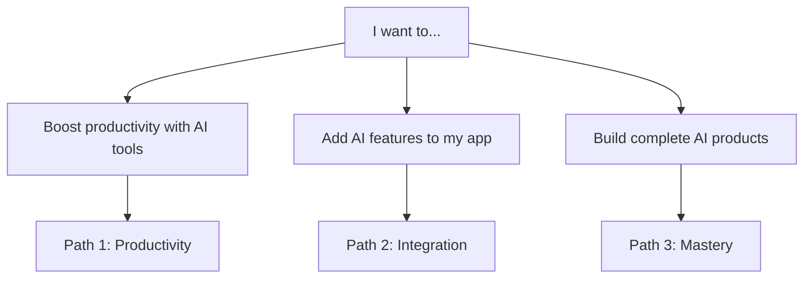

# Learn-AI Project Roadmap

> **Goal**: Transform learn-ai into a comprehensive, production-ready frontend AI learning platform following the approved architecture.

---

## 📊 Current Status

- ✅ Architecture finalized (`architecture.md`)
- ✅ README.md updated with new structure and status markers
- ✅ Directory restructuring and migration (Tasks 1-4) - COMPLETED
- ✅ Learning paths created (Tasks 13-14) - COMPLETED
- ✅ Training concepts overview (Task 5) - COMPLETED
- ✅ AI coding index translated to English
- ⏳ **Next**: Getting started content (Tasks 9-12) and training concepts (Tasks 6-8)
- **Current Phase**: Phase 1 - Foundation & Quick Wins (35% complete)

---

## 🚀 Phase 1: Foundation & Quick Wins

**Goal**: Restructure project + enable users to build AI chatbot in 5 minutes

### 1.1 Directory Migration (CRITICAL PATH)

#### ✅ Task 1: Create New Directory Structure

```bash
mkdir -p docs/getting-started
mkdir -p docs/paths
mkdir -p docs/tech/fundamentals
mkdir -p docs/tech/patterns
mkdir -p docs/tech/training
mkdir -p docs/tech/frontend
mkdir -p docs/tech/engineering
mkdir -p docs/integration/apis
mkdir -p docs/integration/frameworks
mkdir -p docs/integration/protocols
mkdir -p docs/integration/frontend-ml
mkdir -p docs/cookbook
mkdir -p docs/projects/beginner
mkdir -p docs/projects/intermediate
mkdir -p docs/projects/advanced
mkdir -p docs/use-cases
mkdir -p docs/deployment
```

**Checklist**:

- [x] Run directory creation commands
- [x] Verify all directories exist with `tree docs -L 2`

---

#### ✅ Task 2: Move Existing Files (Preserve Git History)

**Fundamentals Migration**:

```bash
git mv docs/tech/LLM.md docs/tech/fundamentals/
git mv docs/tech/context.md docs/tech/fundamentals/
git mv docs/tech/embeddings.md docs/tech/fundamentals/
git mv docs/tech/prompt docs/tech/fundamentals/
```

**Patterns Migration**:

```bash
git mv docs/tech/RAG.md docs/tech/patterns/
git mv docs/tech/agent docs/tech/patterns/
```

**Integration Migration**:

```bash
mkdir -p docs/integration/protocols
git mv docs/tech/MCP.md docs/integration/protocols/mcp.md
```

**Training Migration**:

```bash
mkdir -p docs/tech/training
git mv docs/tech/SFT.md docs/tech/training/
```

**Checklist**:

- [x] Move fundamentals files (LLM, context, embeddings, prompt)
- [x] Move patterns files (RAG, agent)
- [x] Move MCP to integration/protocols
- [x] Move SFT to tech/training
- [x] Verify with `git status` (should show renames, not deletes/adds)

---

#### ✅ Task 3: Update Internal Links in Moved Files

Files to update:

- [x] `docs/tech/fundamentals/LLM.md` - Update any links to other tech files
- [x] `docs/tech/fundamentals/context.md` - Update links
- [x] `docs/tech/fundamentals/embeddings.md` - Update links
- [x] `docs/tech/fundamentals/prompt/index.md` - Update links
- [x] `docs/tech/patterns/RAG.md` - Update links to fundamentals
- [x] `docs/tech/patterns/agent/index.md` - Update links
- [x] `docs/integration/protocols/mcp.md` - Update all tech/ references
- [x] `docs/tech/training/SFT.md` - Update links to patterns

**Pattern**: Old `(/tech/RAG.md)` → New `(/tech/patterns/RAG)`

---

#### ✅ Task 4: Update VitePress Config Sidebar

File: `docs/.vitepress/config.js`

**Action**: Replace entire sidebar with the structure from architecture.md lines 387-584

**Checklist**:

- [x] Backup current config: `cp docs/.vitepress/config.js docs/.vitepress/config.js.backup`
- [x] Update sidebar with new structure (see architecture.md)
- [x] Test locally: `pnpm docs:dev`
- [x] Verify all existing pages still load
- [x] Check for broken links in console

---

### 1.2 Training Concepts (Concept-Only Content)

#### ✅ Task 5: Create Training Overview (`/docs/tech/training/index.md`)

**Content Requirements**:

- Overview: "When to hire ML engineers"
- Decision tree: RAG vs SFT
- "99% use RAG" message
- Table comparing SFT/RLHF/PEFT
- Links to concept pages

**Template** (from architecture.md lines 666-703):

- [x] Copy template from architecture.md
- [x] Customize with examples
- [x] Add Mermaid decision tree diagram
- [x] Link to RAG.md and concept pages

---

#### ✅ Task 6: Simplify SFT.md (400 lines → 100 lines)

**Actions**:

- [ ] **Keep**: "What is SFT?" concept section
- [ ] **Keep**: "When to Use" decision guide
- [ ] **Keep**: "SFT vs RAG" comparison table
- [ ] **Remove**: ALL implementation code
- [ ] **Remove**: Dataset preparation sections
- [ ] **Remove**: Model training scripts
- [ ] **Add**: Callout box "For Implementation: Hire ML Engineers"
- [ ] **Add**: Link to companies that offer fine-tuning (OpenAI, Anthropic)

**Target Length**: ~100 lines, 3-minute read

---

#### ✅ Task 7: Create RLHF.md Concept Page

**Template** (from architecture.md lines 706-741):

- [ ] Copy template from architecture.md
- [ ] Add "Used By" examples (ChatGPT, Claude)
- [ ] Add "Frontend Relevance" callout
- [ ] Link to OpenAI RLHF paper
- [ ] **No implementation code**

---

#### ✅ Task 8: Create PEFT.md Concept Page

**Template** (from architecture.md lines 743-779):

- [ ] Copy template from architecture.md
- [ ] Add LoRA explanation (high-level)
- [ ] Add "When Companies Use PEFT" list
- [ ] Link to LoRA paper
- [ ] **No implementation code**

---

### 1.3 Getting Started Content (HIGH PRIORITY)

#### ✅ Task 9: Create `/docs/getting-started/index.md`

**Content**:

- [ ] Overview of three learning paths
- [ ] "Which path is right for you?" decision tree (Mermaid)
- [ ] Quick links to each path
- [ ] Big CTA button to 5-minute chat
- [ ] Prerequisites link

**Mermaid Diagram Example**:



---

#### ✅ Task 10: Create `/docs/getting-started/5-minute-chat.md` 🏆 MOST IMPORTANT

**Content Requirements**:

- [ ] **Prerequisites**: Node.js, OpenAI API key
- [ ] **Step 1**: Create Next.js project
- [ ] **Step 2**: Install Vercel AI SDK
- [ ] **Step 3**: Create API route with streaming
- [ ] **Step 4**: Create chat UI with `useChat` hook
- [ ] **Step 5**: Run and test
- [ ] **Code**: Complete, copy-paste ready TypeScript
- [ ] **Deploy button**: Add Vercel one-click deploy
- [ ] **Troubleshooting**: Common errors section

**Code Example Structure**:

```typescript
// app/api/chat/route.ts - Complete working example
// app/page.tsx - Complete working example
```

**Success Criteria**: User can copy-paste and have working chat in 5 minutes

---

#### ✅ Task 11: Create `/docs/getting-started/prerequisites.md`

**Content**:

- [ ] Skills needed (React basics, TypeScript basics, Node.js)
- [ ] Tools needed (VS Code, Terminal, Git)
- [ ] API keys setup guide (OpenAI, Anthropic, HuggingFace)
- [ ] Environment setup checklist
- [ ] Links to official setup guides

---

#### ✅ Task 12: Create `/docs/getting-started/setup.md`

**Content**:

- [ ] Install Node.js (with version check)
- [ ] Install pnpm (`npm install -g pnpm`)
- [ ] Create `.env.local` file
- [ ] Test API key with curl command
- [ ] Local development server setup
- [ ] Troubleshooting section

---

### 1.4 Learning Paths Content (HIGH PRIORITY)

#### ✅ Task 13: Create `/docs/paths/index.md`

**Content**:

- [x] Visual learning path diagram (Mermaid flowchart)
- [x] Comparison table of three paths (time, prerequisites, outcomes)
- [x] Links to detailed path pages
- [x] "Start here" recommendations by role

---

#### ✅ Task 14: Create `/docs/paths/productivity.md` (Path 1)

**Structure**:

- [x] **Overview**: What you'll achieve (2-3x productivity)
- [x] **Curriculum**: Cursor + Copilot + Claude CLI
- [x] **Daily tasks** (30 min/day schedule)
- [x] **Tools setup guides** (links to products/ai-coding/)
- [x] **Success milestones** (measurable goals)
- [x] **Next steps**: Link to Path 2

---

#### ✅ Task 15: Create `/docs/paths/integration.md` (Path 2)

**Structure**:

- [ ] **Overview**: What you'll build (AI-powered features)
- [ ] **API Integration fundamentals** (OpenAI, streaming, error handling)
- [ ] **Advanced integration** (RAG, Agents, production patterns)
- [ ] **Practical projects timeline** (chatbot → Q&A → autocomplete)
- [ ] **API integration checklist**
- [ ] **Completion criteria**

---

#### ✅ Task 16: Create `/docs/paths/mastery.md` (Path 3)

**Structure**:

- [ ] **Overview**: What you'll ship (complete AI products)
- [ ] **Advanced RAG patterns**
- [ ] **Production engineering**
- [ ] **Deployment & monitoring**
- [ ] **Production deployment roadmap**
- [ ] **Engineering best practices**
- [ ] **Career advancement tips**
- [ ] **Portfolio projects** to showcase

---

### 1.5 First Project Tutorial

#### ✅ Task 17: Create `/docs/projects/beginner/ai-chatbot.md`

**Content** (Full step-by-step tutorial):

- [ ] **Introduction**: What we're building
- [ ] **Prerequisites**: Node.js, API key
- [ ] **Architecture diagram** (Mermaid)
- [ ] **Step 1-7**: Project setup → Deployment
- [ ] **Complete code** (all files, copy-paste ready)
- [ ] **GitHub template link** (create template repo)
- [ ] **Live demo link** (deploy example)
- [ ] **Troubleshooting** section
- [ ] **Extensions**: How to add memory, tools, etc.

---

### 1.6 Cookbook Recipes

#### ✅ Task 18: Create `/docs/cookbook/index.md`

**Content**:

- [ ] Recipe index with categories (UI, API, Error Handling, Performance, Security)
- [ ] Quick links to popular snippets
- [ ] How to use cookbook (copy-paste instructions)
- [ ] Contribution guidelines

---

#### ✅ Task 19: Create `/docs/cookbook/chat-ui.md`

**Content**:

- [ ] **Problem**: Need reusable streaming chat UI
- [ ] **Solution**: Generic React component
- [ ] **Full code**: TypeScript + React (100-150 lines)
- [ ] **Features**: Streaming, error states, loading states, message history, auto-scroll
- [ ] **Usage example**: How to integrate
- [ ] **Variants**: With/without streaming, different APIs
- [ ] **Customization**: Props and styling

---

### 1.7 Update Homepage

#### ✅ Task 20: Update `/docs/index.md`

**Content**:

- [ ] **Hero section** with new tagline
- [ ] **Feature cards** linking to paths (Productivity, Integration, Mastery)
- [ ] **Quick start CTA** → Link to 5-minute chat
- [ ] **Visual path diagram** (embed from paths/index.md)
- [ ] **Stats/highlights** ("Build AI chatbot in 5 minutes", "100% JavaScript/TypeScript")
- [ ] **Recent projects** showcase
- [ ] **Community links**

---

## ✅ Phase 1 Completion Checklist

Before moving to Phase 2, verify:

- [ ] User can go from landing page to working AI chatbot in < 30 minutes
- [ ] All three learning paths clearly visible on homepage
- [ ] Directory structure migration complete (no files in old locations)
- [ ] No broken links (test with `pnpm docs:dev` and click all nav items)
- [ ] VitePress config updated with new sidebar
- [ ] All moved files have updated internal links
- [ ] Training concepts are concept-only (no implementation code)
- [ ] Git history preserved (use `git log --follow` to verify)

---

## 📋 Phase 2: Core Integration

**Goal**: Cover essential API integration and framework patterns

### 2.1 API Integration Guides

#### ✅ Task 21: Create `/docs/integration/apis/index.md`

- [ ] API comparison table (OpenAI, Anthropic, HuggingFace)
- [ ] Cost comparison chart
- [ ] When to use which API (decision matrix)
- [ ] Rate limits overview
- [ ] Links to detailed guides

---

#### ✅ Task 22: Create `/docs/integration/apis/openai.md`

- [ ] SDK setup (Node.js + TypeScript)
- [ ] Authentication setup
- [ ] Streaming responses (detailed example)
- [ ] Function calling (tools example)
- [ ] Error handling patterns
- [ ] Code examples: Basic completion, Chat with history, Streaming, Function calling
- [ ] Rate limit handling
- [ ] Best practices

---

#### ✅ Task 23: Create `/docs/integration/apis/anthropic.md`

- [ ] Claude-specific patterns
- [ ] SDK setup (@anthropic-ai/sdk)
- [ ] Streaming with Claude
- [ ] Tool use examples (Claude's function calling)
- [ ] System prompts best practices
- [ ] Code examples: Basic call, Streaming, Tool use, Multi-turn conversations
- [ ] Differences from OpenAI

---

#### ✅ Task 24: Create `/docs/integration/apis/huggingface.md`

- [ ] Inference API overview
- [ ] Model selection guide
- [ ] Embedding generation example
- [ ] Free vs Pro tier
- [ ] Code examples: Text generation, Embeddings, Model comparison
- [ ] Local deployment with Transformers.js

---

#### ✅ Task 25: Create `/docs/integration/apis/streaming.md`

- [ ] Universal SSE patterns
- [ ] ReadableStream handling in Node.js
- [ ] Frontend streaming consumption
- [ ] UI state management during streaming
- [ ] Error recovery strategies
- [ ] Code examples: Server-side SSE, Client-side SSE, ReadableStream → AsyncIterator, React streaming UI
- [ ] Common pitfalls

---

### 2.2 Framework Integration

#### ✅ Task 26: Create `/docs/integration/frameworks/index.md`

- [ ] Framework comparison (Vercel AI SDK, LangChain, LlamaIndex)
- [ ] When to use which framework
- [ ] Feature matrix
- [ ] Links to detailed guides

---

#### ✅ Task 27: Create `/docs/integration/frameworks/vercel-ai-sdk.md` 🏆 MOST IMPORTANT

- [ ] `useChat` deep dive (setup, configuration, message handling, custom UI)
- [ ] `useCompletion` patterns (autocomplete, form assistance, suggestions)
- [ ] React Server Components + AI (server actions, streaming from RSC, client integration)
- [ ] Streaming UI patterns (loading states, optimistic updates, error boundaries)
- [ ] Complete examples: Chat UI, Autocomplete, Generative UI
- [ ] Best practices

---

#### ✅ Task 28: Create `/docs/integration/frameworks/langchain-js.md`

- [ ] Chain building for frontend
- [ ] Agent patterns (ReAct, Plan-Execute)
- [ ] Memory management
- [ ] Code examples: Simple chain, RAG chain, Agent with tools
- [ ] Integration with Next.js
- [ ] Performance optimization

---

#### ✅ Task 29: Create `/docs/integration/frameworks/llamaindex-ts.md`

- [ ] RAG implementation with LlamaIndex
- [ ] Document ingestion pipeline
- [ ] Query engine setup
- [ ] Vector store integration
- [ ] Code examples: Basic RAG, Custom embedding, Hybrid search
- [ ] Production patterns

---

#### ✅ Task 30: Create `/docs/integration/frameworks/nextjs.md`

- [ ] Server Actions + AI
- [ ] API Routes patterns
- [ ] Edge Functions for AI
- [ ] Streaming from server components
- [ ] Code examples: API route with streaming, Server action with AI, Edge function deployment
- [ ] Deployment guide

---

### 2.3 MCP Protocol (Practical Guide)

#### ✅ Task 31: Update `/docs/integration/protocols/mcp.md`

- [ ] Focus on practical implementation
- [ ] Tool calling examples
- [ ] Client integration patterns
- [ ] Link to mcp-lab example
- [ ] Code examples from examples/mcp-lab

---

#### ✅ Task 32: Create `/docs/integration/protocols/tool-calling.md`

- [ ] Function calling patterns (OpenAI/Anthropic)
- [ ] Schema design best practices
- [ ] Error handling for tools
- [ ] Code examples: Basic tool definition, Tool execution, Error handling, Multi-tool orchestration
- [ ] Real-world use cases

---

### 2.4 Frontend AI Tech

#### ✅ Task 33: Create `/docs/tech/frontend/streaming.md`

- [ ] SSE implementation (client + server)
- [ ] ReadableStream patterns
- [ ] UI update strategies (character-by-character, word-by-word, chunk-based)
- [ ] Loading states design patterns
- [ ] Code examples: Server SSE endpoint, React streaming component, Error handling
- [ ] Performance optimization

---

#### ✅ Task 34: Create `/docs/tech/frontend/generative-ui.md`

- [ ] Tool calling → React components
- [ ] Dynamic component generation
- [ ] Vercel AI SDK genUI deep dive
- [ ] Code examples: Tool → Component mapping, Dynamic rendering, Type-safe components
- [ ] Real-world examples: Weather widget, Chart generation, Form builder
- [ ] Best practices

---

#### ✅ Task 35: Create `/docs/tech/frontend/browser-ai.md`

- [ ] Transformers.js practical guide
- [ ] WebGPU acceleration setup
- [ ] Model selection for browser
- [ ] Performance optimization
- [ ] Code examples: Text generation in browser, Embedding generation, Image classification
- [ ] Model size vs performance tradeoffs
- [ ] Offline AI capabilities

---

#### ✅ Task 36: Create `/docs/tech/frontend/state-management.md`

- [ ] AI state patterns
- [ ] Vercel AI SDK state (useChat, useCompletion)
- [ ] React Context + AI
- [ ] Zustand/Jotai with AI
- [ ] Code examples: Context provider for AI, State management patterns, Optimistic updates
- [ ] Best practices

---

### 2.5 Cookbook Recipes

#### ✅ Task 37: Create `/docs/cookbook/api-proxy.md`

- [ ] Secure Node.js/Next.js proxy
- [ ] API key protection patterns
- [ ] Rate limiting implementation
- [ ] Code example: Next.js API route proxy, Environment variables, Error handling
- [ ] Security checklist

---

#### ✅ Task 38: Create `/docs/cookbook/local-embedding.md`

- [ ] Browser-side embedding search
- [ ] Transformers.js implementation
- [ ] Vector similarity calculation
- [ ] Code example: Generate embeddings locally, Cosine similarity function, Search implementation
- [ ] Performance considerations

---

#### ✅ Task 39: Create `/docs/cookbook/form-autocomplete.md`

- [ ] AI-powered form completion
- [ ] React hook implementation
- [ ] Debouncing & caching
- [ ] Code example: useAutocomplete hook, Form integration, Caching strategy
- [ ] UX best practices

---

#### ✅ Task 40: Create `/docs/cookbook/error-handling.md`

- [ ] Retry logic patterns
- [ ] Fallback strategies
- [ ] Error boundaries for AI
- [ ] Code examples: Exponential backoff, Fallback models, Error UI components
- [ ] Common errors guide

---

#### ✅ Task 41: Create `/docs/cookbook/content-moderation.md`

- [ ] Input/output filtering
- [ ] Zod schema validation
- [ ] Safety checks
- [ ] Code examples: Input sanitization, Output validation, Content filtering
- [ ] OpenAI moderation API

---

### 2.6 Beginner Projects

#### ✅ Task 42: Create `/docs/projects/beginner/text-summarizer.md`

- [ ] Text summarization UI
- [ ] Chunk management for long texts
- [ ] Token counting
- [ ] Complete tutorial with code
- [ ] GitHub template repo
- [ ] Live demo

---

#### ✅ Task 43: Create `/docs/projects/beginner/image-generator.md`

- [ ] DALL-E integration
- [ ] Image display & download
- [ ] Prompt templates
- [ ] Complete tutorial with code
- [ ] GitHub template repo
- [ ] Live demo

---

## ✅ Phase 2 Completion Checklist

- [ ] User can integrate any major LLM API (OpenAI, Anthropic, HuggingFace)
- [ ] User can implement streaming chat with any framework
- [ ] User can secure API keys properly with proxy pattern
- [ ] All framework guides complete and tested
- [ ] All cookbook recipes are copy-paste ready
- [ ] All code examples run without modification

---

## 📋 Phase 3: Production Ready

**Goal**: Complete professional AI development journey

### 3.1 Engineering Practices

#### ✅ Task 44: Create `/docs/tech/engineering/testing.md`

- [ ] Unit tests for RAG components
- [ ] Prompt testing strategies
- [ ] Integration test patterns
- [ ] Mock LLM responses
- [ ] Code examples with Jest/Vitest

---

#### ✅ Task 45: Create `/docs/tech/engineering/evals.md`

- [ ] Evaluation metrics (precision/recall)
- [ ] A/B testing for prompts
- [ ] Quality scoring
- [ ] User feedback loops
- [ ] Tools: LangSmith, Braintrust

---

#### ✅ Task 46: Create `/docs/tech/engineering/observability.md`

- [ ] Logging AI requests
- [ ] TTFT (Time To First Token) tracking
- [ ] Token usage monitoring
- [ ] Error tracking (Sentry)
- [ ] Dashboard examples

---

#### ✅ Task 47: Create `/docs/tech/engineering/security.md`

- [ ] API key protection patterns
- [ ] Content Security Policy
- [ ] Input sanitization
- [ ] Rate limiting implementation
- [ ] OWASP AI security

---

#### ✅ Task 48: Create `/docs/tech/engineering/cost-optimization.md`

- [ ] Token counting strategies
- [ ] Response caching
- [ ] Model selection by cost
- [ ] Budget alerts
- [ ] Cost calculator tool

---

### 3.2 Intermediate Projects

#### ✅ Task 49: Create `/docs/projects/intermediate/rag-search.md` 🏆 IMPORTANT

- [ ] Full RAG implementation
- [ ] Vector database setup (pgvector)
- [ ] Document ingestion pipeline
- [ ] Query interface
- [ ] Complete tutorial
- [ ] GitHub template
- [ ] Live demo

---

#### ✅ Task 50: Create `/docs/projects/intermediate/code-completion.md`

- [ ] Monaco editor integration
- [ ] AI completion suggestions
- [ ] Context-aware completions
- [ ] Complete tutorial
- [ ] GitHub template
- [ ] Live demo

---

#### ✅ Task 51: Create `/docs/projects/intermediate/ai-form-builder.md`

- [ ] Generative UI forms
- [ ] Dynamic field generation
- [ ] Validation rules from AI
- [ ] Complete tutorial
- [ ] GitHub template
- [ ] Live demo

---

#### ✅ Task 52: Create `/docs/projects/intermediate/semantic-search.md`

- [ ] Vector search UI
- [ ] Embedding generation
- [ ] Similarity ranking
- [ ] Complete tutorial
- [ ] GitHub template
- [ ] Live demo

---

### 3.3 Advanced Projects

#### ✅ Task 53: Create `/docs/projects/advanced/full-stack-saas.md` 🏆 IMPORTANT

- [ ] Complete AI SaaS application
- [ ] Auth (NextAuth.js)
- [ ] Payments (Stripe)
- [ ] RAG + streaming
- [ ] Production deployment
- [ ] Comprehensive tutorial
- [ ] GitHub template
- [ ] Live demo

---

#### ✅ Task 54: Create `/docs/projects/advanced/multi-agent-app.md`

- [ ] Agent orchestration
- [ ] Tool coordination
- [ ] Multi-step workflows
- [ ] Complete tutorial
- [ ] GitHub template
- [ ] Live demo

---

#### ✅ Task 55: Create `/docs/projects/advanced/ai-design-tool.md`

- [ ] AI-powered design system
- [ ] Component generation
- [ ] Style suggestions
- [ ] Complete tutorial
- [ ] GitHub template
- [ ] Live demo

---

### 3.4 Deployment Guides

#### ✅ Task 56: Create `/docs/deployment/index.md`

- [ ] Deployment options overview
- [ ] Cost comparison
- [ ] Performance comparison
- [ ] Decision matrix

---

#### ✅ Task 57: Create `/docs/deployment/vercel-edge.md`

- [ ] Edge Functions setup
- [ ] Streaming from edge
- [ ] Environment variables
- [ ] Complete deployment guide

---

#### ✅ Task 58: Create `/docs/deployment/cloudflare-workers.md`

- [ ] Workers AI integration
- [ ] KV storage for caching
- [ ] R2 for vector storage
- [ ] Complete deployment guide

---

#### ✅ Task 59: Create `/docs/deployment/caching.md`

- [ ] Response caching strategies
- [ ] Redis integration
- [ ] Edge caching
- [ ] Cache invalidation

---

#### ✅ Task 60: Create `/docs/deployment/rate-limiting.md`

- [ ] Rate limiting patterns
- [ ] User quotas
- [ ] Cost controls
- [ ] Implementation examples

---

#### ✅ Task 61: Create `/docs/deployment/monitoring.md`

- [ ] Production monitoring setup
- [ ] Alert configuration
- [ ] Dashboard examples
- [ ] Tools: Vercel Analytics, Datadog

---

#### ✅ Task 62: Create `/docs/deployment/cost-calculator.md`

- [ ] Interactive cost calculator
- [ ] Budget planning tool
- [ ] ROI analysis
- [ ] Model comparison

---

### 3.5 Use Cases

#### ✅ Task 63: Create `/docs/use-cases/index.md`

- [ ] Use cases by industry
- [ ] Complexity ratings
- [ ] Implementation time estimates
- [ ] Links to tutorials

---

#### ✅ Task 64: Create `/docs/use-cases/add-ai-search.md`

- [ ] Add AI search to existing app
- [ ] Migration strategy
- [ ] Zero-downtime deployment
- [ ] Code examples

---

#### ✅ Task 65: Create `/docs/use-cases/migrate-to-ai.md`

- [ ] Legacy system migration
- [ ] Gradual AI adoption
- [ ] Risk mitigation
- [ ] Case studies

---

#### ✅ Task 66: Create `/docs/use-cases/ai-analytics.md`

- [ ] AI analytics dashboard
- [ ] Natural language queries
- [ ] Chart generation
- [ ] Complete example

---

#### ✅ Task 67: Create `/docs/use-cases/recommendations.md`

- [ ] Recommendation engine
- [ ] Personalization strategies
- [ ] User behavior analysis
- [ ] Implementation guide

---

#### ✅ Task 68: Create `/docs/use-cases/accessibility.md`

- [ ] AI for accessibility
- [ ] Screen reader optimization
- [ ] Auto alt-text generation
- [ ] Best practices

---

## ✅ Phase 3 Completion Checklist

- [ ] User can deploy AI app to production (Vercel or Cloudflare)
- [ ] User understands cost optimization strategies
- [ ] User can monitor and debug AI features
- [ ] All engineering practices documented
- [ ] At least 3 advanced projects complete with live demos

---

## 📋 Phase 4: Advanced & Ecosystem

**Goal**: Deep expertise and community growth

### 4.1 Frontend ML Libraries

#### ✅ Task 69: Create `/docs/integration/frontend-ml/index.md`

- [ ] Library comparison
- [ ] Use case guide
- [ ] Performance comparison

---

#### ✅ Task 70: Create `/docs/integration/frontend-ml/transformersjs.md`

- [ ] Hugging Face in browser
- [ ] Model selection
- [ ] Performance optimization
- [ ] Complete examples

---

#### ✅ Task 71: Create `/docs/integration/frontend-ml/tensorflowjs.md`

- [ ] Custom model deployment
- [ ] Training in browser
- [ ] Model conversion
- [ ] Complete examples

---

#### ✅ Task 72: Create `/docs/integration/frontend-ml/ml5js.md`

- [ ] Beginner ML library
- [ ] Pre-trained models
- [ ] Simple integrations
- [ ] Complete examples

---

#### ✅ Task 73: Create `/docs/integration/frontend-ml/onnx-runtime.md`

- [ ] ONNX models in browser
- [ ] WebAssembly acceleration
- [ ] Model optimization
- [ ] Complete examples

---

### 4.2 Working Examples (Code Repositories)

#### ✅ Task 74: Create `/examples/01-chat-basic/`

- [ ] Basic streaming chat implementation
- [ ] GitHub template repo
- [ ] Live demo on Vercel
- [ ] Complete README

---

#### ✅ Task 75: Create `/examples/02-rag-search/`

- [ ] RAG implementation
- [ ] Vector database integration
- [ ] Complete with tests
- [ ] GitHub template repo
- [ ] Live demo

---

#### ✅ Task 76: Create `/examples/03-generative-ui/`

- [ ] Generative UI demo
- [ ] Dynamic component rendering
- [ ] Tool calling examples
- [ ] GitHub template repo
- [ ] Live demo

---

#### ✅ Task 77: Create `/examples/04-browser-ai/`

- [ ] Transformers.js demo
- [ ] Offline AI functionality
- [ ] Model comparison
- [ ] GitHub template repo
- [ ] Live demo

---

#### ✅ Task 78: Create `/examples/05-full-stack-app/`

- [ ] Complete AI SaaS
- [ ] Auth, payments, RAG
- [ ] Production-ready
- [ ] GitHub template repo
- [ ] Live demo

---

### 4.3 Resources & Community

#### ✅ Task 79: Create `/docs/resources.md`

- [ ] Curated library list
- [ ] UI component libraries (Shadcn AI, Vercel AI UI)
- [ ] Video tutorials
- [ ] Community forums
- [ ] Influencer blogs

---

#### ✅ Task 80: Create `/docs/products/tools/figma-ai.md`

- [ ] AI design tools
- [ ] Figma AI plugins
- [ ] Design workflow integration

---

#### ✅ Task 81: Create `/docs/products/tools/testing-ai.md`

- [ ] Cypress AI
- [ ] TestGPT
- [ ] AI-powered testing tools

---

## ✅ Phase 4 Completion Checklist

- [ ] 5+ working example repositories
- [ ] Frontend ML libraries documented
- [ ] Community resources curated
- [ ] Advanced patterns documented

---

## 📊 Overall Progress

### Task Summary

- **Phase 1: Foundation & Quick Wins** - 20 tasks
- **Phase 2: Core Integration** - 23 tasks
- **Phase 3: Production Ready** - 25 tasks
- **Phase 4: Advanced & Ecosystem** - 13 tasks

**Total**: 81 tasks

### Priority Tasks (Complete First)

1. 🏆 **Directory restructuring** (Tasks 1-4) - CRITICAL
2. 🏆 **5-minute chat tutorial** (Task 10) - MOST IMPORTANT
3. 🏆 **Learning path guides** (Tasks 13-16)
4. 🏆 **Vercel AI SDK guide** (Task 27)
5. 🏆 **RAG search project** (Task 49)
6. 🏆 **Full-stack SaaS project** (Task 53)

---

## 📝 Content Standards Reference

### Every Technical Document Must Include

1. **Prerequisites**: What knowledge/tools needed
2. **Learning Objectives**: What you'll learn
3. **Theory Section**: Explain the concept
4. **Code Example**: Working, runnable code
5. **Real-World Use Case**: When to use this
6. **Common Pitfalls**: What to avoid
7. **Next Steps**: Where to go from here

### Code Examples Must Be

- ✅ **Complete**: Copy-paste runnable
- ✅ **TypeScript**: Prefer TS over JS
- ✅ **Modern**: async/await, fetch, etc.
- ✅ **Commented**: Explain non-obvious parts
- ✅ **Error handling**: Show proper patterns
- ✅ **Framework variants**: React/Vue/Next.js examples

### Project Tutorials Must Include

- ✅ **GitHub Repository**: Template to clone
- ✅ **Live Demo**: Deployed on Vercel/Netlify
- ✅ **Step-by-Step Guide**: Numbered steps
- ✅ **Commit History**: Each step as commit
- ✅ **Troubleshooting**: Common issues
- ✅ **Extensions**: How to expand

---

## 🚀 Quick Start

### To Begin:

1. **Start with directory migration** (Tasks 1-4)

   ```bash
   # Task 1: Create directories
   mkdir -p docs/getting-started
   mkdir -p docs/paths
   # ... etc
   ```

2. **Move files** (Task 2)

   ```bash
   # Preserve git history
   git mv docs/tech/LLM.md docs/tech/fundamentals/
   # ... etc
   ```

3. **Create 5-minute chat** (Task 10)

   - MOST IMPORTANT first deliverable
   - Target: User working chatbot in 5 minutes

4. **Update VitePress config** (Task 4)
   - Essential for navigation

---

**Last Updated**: 2026-01-10
**Status**: Ready for Implementation
**Architecture Reference**: `architecture.md`
