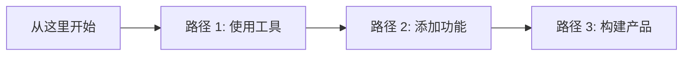

  
为什么是前端优先？

  
大多数 AI 教程使用 Python。我们使用 <strong>JavaScript/TypeScript</strong>。我们专注于可落地的技能：流式 UI (Streaming UI)、浏览器端 AI (Browser AI) 和边缘部署 (Edge Deployment)。

## 你的旅程

## 最近更新

- **[MCP 协议](/zh/integration/protocols/mcp)**: 将 LLM 连接到你自己的工具和数据。
- **[浏览器端 AI](/zh/tech/frontend/browser-ai)**: 使用 WebGPU 在浏览器中运行模型。
- **[聊天 UI 组件](/zh/cookbook/chat-ui)**: 一个即拷即用的流式聊天组件。

## 社区

- [GitHub 仓库](https://github.com/zenheart/learn-ai)
- [Vercel AI SDK 文档](https://sdk.vercel.ai/docs)
