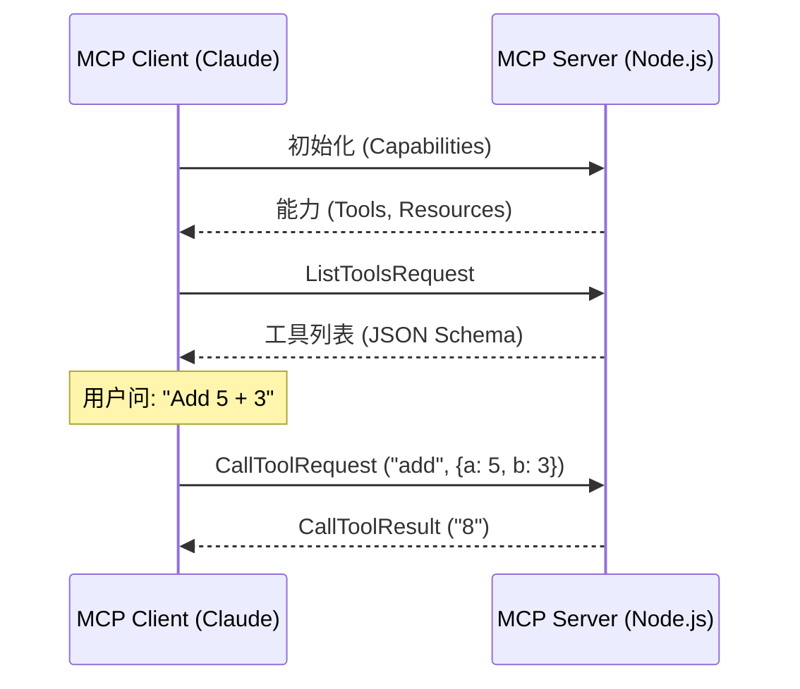

# 模型上下文协议 (MCP) 实现指南

**模型上下文协议 (MCP)** 是将 AI 模型连接到外部工具和数据的开放标准。

> **动手示例**: 我们在此仓库中提供了一个完整的工作示例。
>
> 📂 **[查看 MCP Lab 示例](../../../examples/mcp-lab/README.md)**

## 核心实现概念

MCP 连接两端：
1.  **宿主 (Client)**: AI 应用程序（例如 Claude Desktop, Cursor 或你的自定义应用）。
2.  **服务器 (Server)**: 工具和资源的提供者（例如你的 Node.js 脚本）。

### 通信流程



## 分步实现

以下是如何使用 `@modelcontextprotocol/sdk` 构建生产级 MCP 服务器。

### 1. 服务器设置

```typescript
import { Server } from "@modelcontextprotocol/sdk/server/index.js";
import { StdioServerTransport } from "@modelcontextprotocol/sdk/server/stdio.js";
import {
  CallToolRequestSchema,
  ListToolsRequestSchema,
} from "@modelcontextprotocol/sdk/types.js";
import { z } from "zod";

// Initialize Server with name and version
const server = new Server(
  {
    name: "my-mcp-server",
    version: "1.0.0",
  },
  {
    capabilities: {
      tools: {}, // We are providing tools
    },
  }
);
```

### 2. 定义工具

你必须定义 **Schema** (AI 看到什么) 和 **Handler** (运行什么代码)。

```typescript
// Define what tools are available
server.setRequestHandler(ListToolsRequestSchema, async () => {
  return {
    tools: [
      {
        name: "calculate_sum",
        description: "Add two numbers together",
        inputSchema: {
          type: "object",
          properties: {
            a: { type: "number" },
            b: { type: "number" },
          },
          required: ["a", "b"],
        },
      },
    ],
  };
});
```

### 3. 处理工具调用

```typescript
// Execute the logic when AI calls the tool
server.setRequestHandler(CallToolRequestSchema, async (request) => {
  const { name, arguments: args } = request.params;

  if (name === "calculate_sum") {
    // Validate inputs with Zod
    const schema = z.object({ a: z.number(), b: z.number() });
    const { a, b } = schema.parse(args);
    
    return {
      content: [
        {
          type: "text",
          text: `The sum is ${a + b}`,
        },
      ],
    };
  }

  throw new Error(`Unknown tool: ${name}`);
});
```

### 4. 连接传输

MCP 通常通过 Stdio（标准输入/输出）用于本地应用，或 SSE（服务器发送事件）用于远程应用。

```typescript
async function main() {
  const transport = new StdioServerTransport();
  await server.connect(transport);
  console.error("MCP Server running on Stdio");
}

main();
```

## 客户端集成模式

你如何使用此服务器？

### 选项 A: Claude Desktop (最简单)

将此添加到你的 `claude_desktop_config.json`：

```json
{
  "mcpServers": {
    "my-lab-server": {
      "command": "node",
      "args": ["/absolute/path/to/learn-ai/examples/mcp-lab/src/index.js"]
    }
  }
}
```

### 选项 B: 自定义客户端 (高级)

如果你正在构建自己的 AI 应用程序（例如使用 LangChain），你可以充当 MCP 客户端。

```typescript
import { Client } from "@modelcontextprotocol/sdk/client/index.js";
import { StdioClientTransport } from "@modelcontextprotocol/sdk/client/stdio.js";

const transport = new StdioClientTransport({
  command: "node",
  args: ["./my-server.js"],
});

const client = new Client({ name: "my-client", version: "1.0" }, { capabilities: {} });
await client.connect(transport);

// List available tools
const { tools } = await client.listTools();

// Call a tool
const result = await client.callTool({
  name: "calculate_sum",
  arguments: { a: 10, b: 20 },
});
```

## 安全最佳实践

1.  **输入验证**: 始终使用 Zod 验证参数。AI 可能会产生类型的幻觉。
2.  **路径遍历**: 如果创建文件系统工具，确保用户无法访问 `../../etc/passwd`。
3.  **只读默认值**: 在允许写入/删除操作之前，先从只读工具开始。

## 下一步

- **[工具调用指南](./tool-calling.md)**: 深入了解函数调用模式。
- **[MCP Lab 示例](../../../examples/mcp-lab/)**: 在本地运行完整代码。
