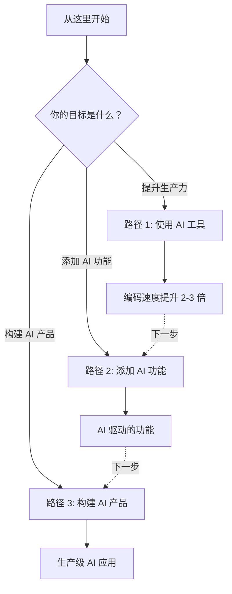

# 学习路径概览

根据你的目标和当前技能水平选择你的学习路径。

## 通往 AI 精通的三条路径

## 路径对比

| 路径 | 难度 | 先决条件 | 你将构建 |
|------|------------|---------------|--------------|
| **[路径 1: 使用 AI 工具](./productivity.md)** | 初级 | 基础编程知识 | 精通生产力工具 |
| **[路径 2: 添加 AI 功能](./integration.md)** | 中级 | JavaScript, React 基础 | 聊天机器人、AI 搜索、智能表单 |
| **[路径 3: 构建 AI 产品](./mastery.md)** | 高级 | 全栈开发经验 | 完整的 AI SaaS 应用 |

---

## 路径 1: 使用 AI 工具

掌握 AI 编程助手，使用 Cursor, Copilot, Claude CLI 和 Gemini CLI 将编码速度提升 2-3 倍。

**学习成果**:
- ⚡️ 使用 AI 自动补全将编码速度提升 2-3 倍
- 🐛 在几分钟内（而不是几小时）完成调试
- 📚 快速学习新代码库
- ✨ 瞬间生成样板代码

**[开始路径 1 →](./productivity.md)**

---

## 路径 2: 添加 AI 功能

使用 JavaScript/TypeScript 将 AI 能力集成到现有应用中。

**学习成果**:
- 🤖 构建流式 AI 聊天机器人
- 🔍 使用 RAG 实现语义搜索
- 📝 创建 AI 驱动的表单
- 🛠️ 使用 OpenAI, Anthropic 和 HuggingFace API

**[开始路径 2 →](./integration.md)**

---

## 路径 3: 构建 AI 产品

从零开始设计、构建并部署生产级 AI 应用。

**学习成果**:
- 🚀 将 AI 应用部署到 Edge/Workers
- 📊 实现监控和可观测性
- 💰 优化成本和性能
- 🔒 处理安全和速率限制
- 🧪 测试和评估 AI 系统

**[开始路径 3 →](./mastery.md)**

---

## 如何选择你的路径

### 从路径 1 开始，如果...
- ✅ 你是 AI 开发新手
- ✅ 你想要立竿见影的效率提升
- ✅ 你通过动手使用工具学得最好
- ✅ 你时间有限 (1-2 周)

### 跳至路径 2，如果...
- ✅ 你每天都在使用 AI 编程工具
- ✅ 你想为你的应用添加 AI 功能
- ✅ 你熟悉 JavaScript/TypeScript
- ✅ 你可以投入 2-4 周

### 越级到路径 3，如果...
- ✅ 你以前构建过 AI 功能
- ✅ 你计划构建生产级 AI 应用
- ✅ 你理解 RAG、Embeddings 和 Agents
- ✅ 你需要部署和扩展知识

---

## 各路径先决条件

### 路径 1: 使用 AI 工具
- 基础编程知识（任何语言）
- 代码编辑器（推荐 VS Code）
- 尝试新工作流的意愿

### 路径 2: 添加 AI 功能
- 精通 JavaScript/TypeScript
- React 或 Vue 经验
- API 基础理解
- Node.js 环境配置

### 路径 3: 构建 AI 产品
- 全栈开发经验
- 理解路径 2 的概念
- DevOps 基础（部署、监控）
- 数据库经验

---

## 学习路径路线图

### 建议进度

**第 1 个月**: 路径 1 - 使用 AI 工具
- 第 1-2 周: 掌握 AI 编程助手
- 在实际项目中每天练习

**第 2-3 个月**: 路径 2 - 添加 AI 功能
- 第 3-4 周: API 集成基础
- 第 5-6 周: 构建聊天机器人和 RAG 搜索
- 第 7-8 周: 高级模式 (Agents, Tools)

**第 4 个月+**: 路径 3 - 构建 AI 产品
- 第 9-10 周: 生产环境部署
- 第 11-12 周: 监控和优化
- 第 13-16 周: 完成 AI SaaS 项目

**精通所需总时间**: 3-4 个月 (每天 30-60 分钟)

---

## 快速入门建议

### 我是前端开发者
1. 开始: **路径 1** (使用 AI 工具加速 React/Vue 开发)
2. 下一步: **路径 2** (为你的应用添加 AI 聊天)
3. 最终: **路径 3** (构建完整的 AI 产品)

### 我是后端开发者
1. 开始: **路径 1** (使用 AI 进行 API 开发)
2. 下一步: **路径 2** (集成 LLM API)
3. 最终: **路径 3** (架构 AI 基础设施)

### 我是产品经理
1. 开始: **路径 1** (理解 AI 能力)
2. 下一步: **路径 2** (原型化 AI 功能)
3. 考虑: 为路径 3 寻求外部开发支持

### 我是创业公司创始人
1. 开始: **路径 2** (快速验证 AI 功能)
2. 并行: **路径 1** (提升团队效率)
3. 下一步: **路径 3** (扩展到生产环境)

---

## 额外资源

### 开始之前

- [AI 决策框架](https://github.com/zenheart/learn-ai#5-the-ai-decision-framework-for-frontend-engineers)

### 参考资料
- [技术栈概览](../tech/index.md)
- [AI 编程工具](../products/ai-coding/index.md)
- [提示工程](../tech/prompt/index.md)

### 社区
- [GitHub 讨论区](https://github.com/zenheart/learn-ai/discussions)
- [贡献指南](https://github.com/zenheart/learn-ai/blob/master/CONTRIBUTING.md) 🚧 (即将推出)

---

## 常见问题

**Q: 我可以跳过路径吗？**
A: 可以，但我们建议每个人都学习路径 1。掌握 AI 编程工具是所有 AI 开发的基础。

**Q: 我每天需要多少时间？**
A: 每天 30-60 分钟是最理想的。坚持比强度更重要。

**Q: 我需要付费订阅 AI 工具吗？**
A: 路径 1 需要订阅（Cursor $20/月 或 Copilot $10/月）。路径 2-3 使用按量付费 API（学习期间约 $5-20/月）。

**Q: 有考核吗？**
A: 每个路径都有自我评估里程碑。我们要未来添加认证选项。

**Q: 我可以团队学习吗？**
A: 当然！我们鼓励团队学习。使用 AI 工具进行结对编程非常高效。

---

**准备好开始了吗？** 选择你的路径，开始你的 AI 精通之旅！

- **[路径 1: 使用 AI 工具](./productivity.md)** - 从这里开始
- **[路径 2: 添加 AI 功能](./integration.md)** - 将 AI 集成到应用中
- **[路径 3: 构建 AI 产品](./mastery.md)** - 生产级 AI 系统