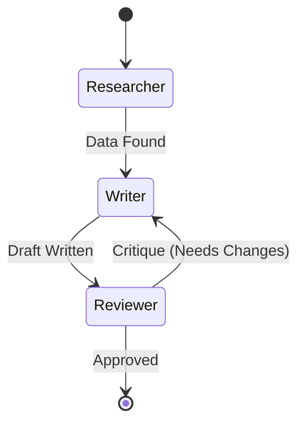

# Project: Multi-Agent Research Team

**Level**: Advanced
**Time**: 4 hours
**Stack**: LangChain (LangGraph) or Vercel AI SDK

## Overview

Build a system where multiple AI agents collaborate.
- **Researcher**: Searches the web.
- **Writer**: Writes a report based on research.
- **Reviewer**: Critiques the report.

## The Loop (State Machine)



## Implementation (Vercel AI SDK Core)

You can build this without heavy frameworks by passing context.

```typescript
// 1. Researcher Step
const research = await generateText({
  model: openai('gpt-4o'),
  tools: { webSearch },
  prompt: "Research the history of Sourdough.",
});

// 2. Writer Step
const draft = await generateText({
  model: 'claude-3-5-sonnet', // Use Claude for writing
  prompt: `Write a blog post based on this research: ${research.text}`,
});

// 3. Reviewer Step
const review = await generateText({
  model: 'gpt-4o',
  prompt: `Review this draft. If good, say APPROVED. Else, list fixes.\n${draft.text}`,
});

if (review.text !== 'APPROVED') {
  // Loop back to writer
}
```

## Implementation (LangGraph)

For complex loops, use LangGraph.

```typescript
import { StateGraph } from "@langchain/langgraph";

const workflow = new StateGraph({ channels: stateChannels })
  .addNode("researcher", researcherAgent)
  .addNode("writer", writerAgent)
  .addEdge("researcher", "writer")
  .compile();
```

## Challenge
Can you build a **Coding Agent**?
1.  Agent writes code.
2.  Agent runs code (in sandbox).
3.  If error, Agent reads error and fixes code.
4.  Repeat.

```
