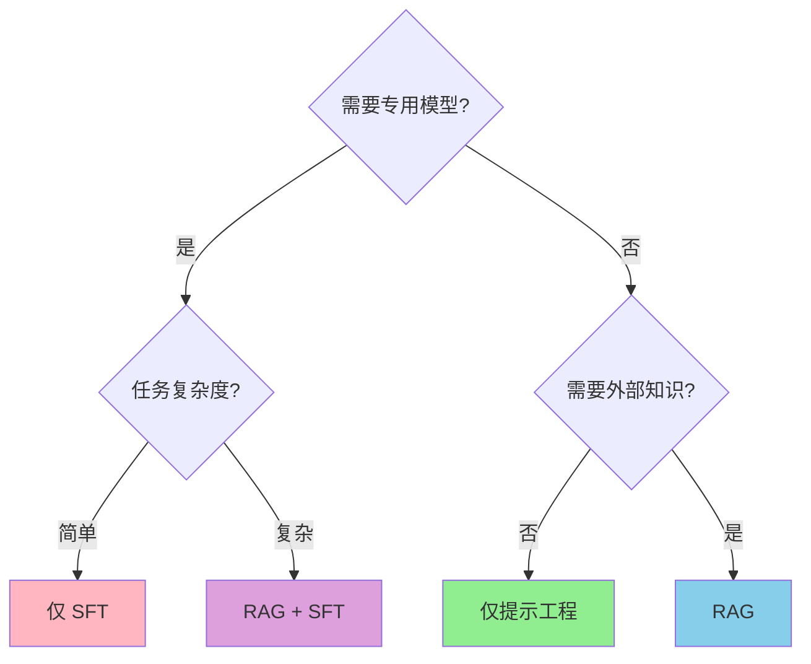

# 技术栈

本节将探讨构建智能应用所需的核心 AI 技术和模式。每种技术都有其特定的解决场景——理解**何时**使用**什么**至关重要。

## AI 应用开发的三大支柱

### 1. **LLM (大语言模型)** - 基础

**是什么**: 理解并生成文本的预训练模型。

**何时使用**: 所有 AI 应用的起点。

**了解更多**: [LLM 指南](/zh/tech/fundamentals/LLM.md)

### 2. **提示工程 (Prompt Engineering)** - 接口

**是什么**: 与 LLM 有效沟通的技术。

**何时使用**: 任何与 LLM 的交互都需要好的提示词。

**了解更多**: [提示工程](/zh/tech/prompt/)

### 3. **上下文管理 (Context Management)** - 记忆

**是什么**: 管理 LLM 能看到和记住的信息。

**何时使用**: 聊天应用、文档问答、任何多轮交互。

**了解更多**: [上下文指南](/zh/tech/fundamentals/context.md)

## 核心技术对比

### 微调 (SFT) vs 检索增强生成 (RAG)

| 维度 | 微调 (SFT) | RAG (检索增强生成) |
|--------|-------------------|--------------------------------------|
| **核心原理** | 调整模型参数以适应特定任务 | 检索外部知识以增强生成 |
| **成本** | **高** - 需要 GPU、标注数据、重新训练 | **低** - 使用外部知识库，仅需推理 |
| **响应时间** | **快** - 知识内化在模型中 | **较慢** - 生成前需要检索步骤 |
| **适用场景** | 领域特定术语、复杂推理 | 高准确性要求、知识频繁更新 |
| **维护** | **难** - 更新需要重新训练 | **易** - 随时更新知识库 |
| **可控性** | 黑盒，训练后行为固定 | 透明，可通过知识库控制 |
| **搭建复杂度** | 非常高 (数天/数周) | 中等 (数小时/数天) |
| **何时使用** | 专业领域、知识稳定 | 动态数据、可解释 AI、成本敏感 |

**前端工程师建议**: 从 RAG 开始。仅在以下情况考虑微调：
- 高度专业化的领域 (医疗、法律等)
- 有 GPU 训练预算
- 知识稳定且极少变更

## 技术决策树

### 决策指南

**场景 1: 为产品文档构建聊天机器人**
- ✅ 使用: RAG (文档频繁更新)
- ❌ 不使用: 微调 (昂贵，难以更新)

**场景 2: 构建代码补全工具**
- ✅ 使用: 提示工程 + 上下文管理
- 可能: RAG (用于项目特定模式)
- ❌ 不使用: 微调 (除非你是 GitHub Copilot)

**场景 3: 医疗诊断助手**
- ✅ 使用: RAG + 微调
- 原因: 专业术语 (SFT) + 最新研究 (RAG)

**场景 4: 简单的 AI 聊天功能**
- ✅ 使用: 仅提示工程
- 原因: 大多数 LLM 已经很擅长对话

## 推荐工具与平台

### 开发框架
1. **LangChain** - Python/JS 的 LLM 应用框架
2. **Vercel AI SDK** - React 优先的 AI 框架
3. **LlamaIndex** - RAG 和数据框架
4. **Anthropic SDK** - Claude 集成

### 向量数据库 (RAG)
1. **Pinecone** - 托管型向量数据库
2. **Weaviate** - 开源向量搜索
3. **pgvector** - Postgres 扩展
4. **Chroma** - 轻量级，可嵌入

### 低代码平台
1. **Dify** - 开源 LLM 应用平台
2. **Flowise** - 可视化 LLM 工作流构建器
3. **LangFlow** - 拖拽式 LLM 链

### 本地开发
1. **Ollama** - 本地运行 LLM
2. **LocalAI** - 自托管 AI API
3. **LM Studio** - 本地模型 GUI

## 学习路径建议

**第 1-2 周**: 基础
- 掌握 [LLM 基础](/zh/tech/fundamentals/LLM.md)
- 学习 [提示工程](/zh/tech/prompt/)
- 理解 [上下文管理](/zh/tech/fundamentals/context.md)

**第 3-4 周**: 构建功能
- 实现 [RAG](/zh/tech/patterns/RAG.md) 进行知识检索
- 探索 [MCP](/zh/integration/protocols/mcp.md) 进行工具集成
- 构建简单的 [Agents](/zh/tech/patterns/agent/index.md)

**第 5 周+**: 高级模式
- 微调 ([SFT](/zh/tech/training/SFT.md)) 以满足特定需求
- 生产环境优化
- 多智能体工作流

## 避免常见的误区

1. **过度设计**: 如果简单的提示词能解决问题，就不要用 RAG
2. **错误的模型选择**: 简单任务使用更便宜的模型
3. **忽视上下文限制**: 始终管理 Token 使用量
4. **无错误处理**: LLM 会失败——要有后备方案
5. **过早微调**: 先尝试 RAG 和提示工程

## 下一步

根据你的直接需求选择学习路径：

- **需要了解基础？** → 从 [LLM](/zh/tech/fundamentals/LLM.md) 开始
- **构建聊天功能？** → 查看 [提示工程](/zh/tech/prompt/)
- **添加外部知识？** → 学习 [RAG](/zh/tech/patterns/RAG.md)
- **构建自主 AI？** → 探索 [Agent](/zh/tech/patterns/agent/index.md) 和 [MCP](/zh/integration/protocols/mcp.md)
- **管理成本/性能？** → 阅读 [上下文管理](/zh/tech/fundamentals/context.md)
- **需要专用模型？** → 查看 [SFT](/zh/tech/training/SFT.md)

本节中的技术是你的构建模块。掌握它们以创建强大的、生产级的 AI 应用程序。